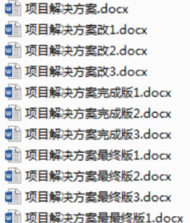
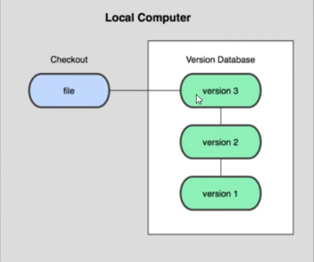
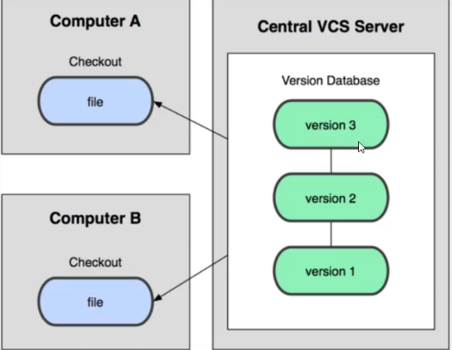
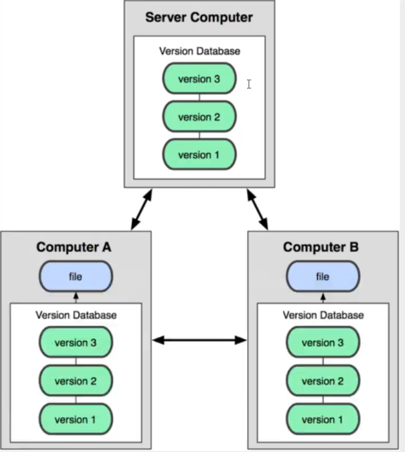
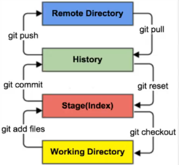
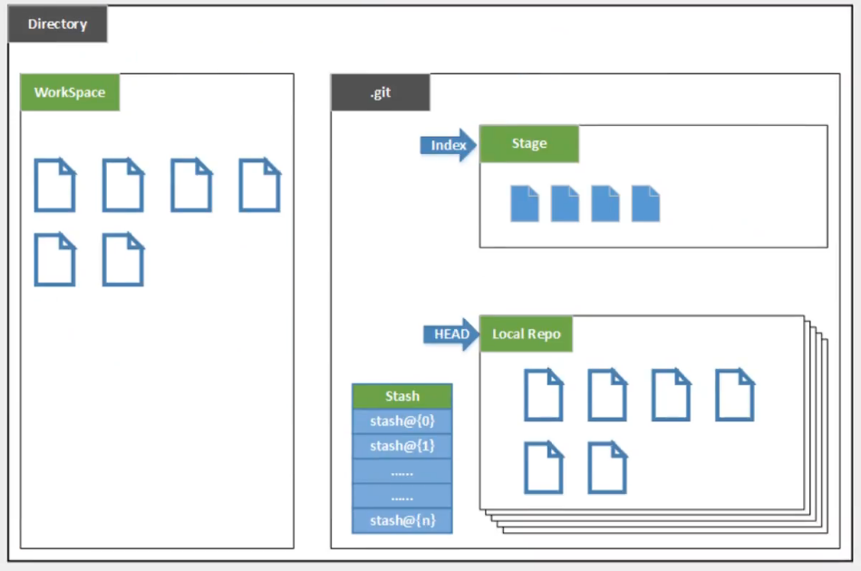
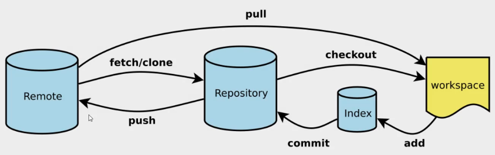

# 一、认识Git

使用Git之前，先理解==版本控制==

## 版本控制

> 什么是版本控制，版本管理器

版本控制（Revision control）是一种在开发的过程中用于管理我们对文件、目录或工程的修改历史，方便查看更改历史记录，备份以便于恢复以前的版本的软件工程技术

- 实现跨区多人协同开发
- 追踪和记录一个或者多个文件的历史记录
- 组织和保护你的源代码和文档
- 统计工作量
- 并行开发‘提高开发效率
- 追踪记录整个软件开发过程
- 减轻开发人员的负担，节省时间，同时降低人为错误

简单说就是用于管理多人协同开发项目的技术

没有进行版本控制或者版本控制本身缺乏正确的流程管理，在软件开发过程中将会引入很多问题，如软件代码的一致性、软件内容的冗余、软件过程的事物性、软件开发过程中的的并发性、软件源码的安全性，以及软件的整合等问题

无论是工作还是学习，或者是自己做笔记，都经历过这样一个阶段！我们迫切需要一个版本控制工具




多人开发就必须使用版本控制工具


####  常见的版本控制工具

主流的版本控制器有：

- **Git**
- **SVN**（Subversion）
- **CVS**（Concurrent Versions System）
- **VSS**（Micorosoft Visual SourceSafe）
- **TFS**（Team Foundation Server）
- **Visual Studio Online**

版本控制产品非常的多（Perforce、BitKeeper……），现在最流行的是Git和SVN


#### 版本控制的分类

**1、本地版本控制**

记录文件每次的更新，可以对每个版本做一个快照，或是记录补丁文件，适合个人使用，如RCS



**2、集中版本控制 SVN**

所用的版本数据都保存在服务器上，协同开发者从服务器上同步更新或上传自己的修改



所有的版本数据都存在服务器上，用户的本地只有自己以前所同步的版本，如果网络中断，用户就看不到历史版本，也无法切换版本验证问题，或在不同的分支工作，而且，所有的数据都存放在单一的服务器上，如果服务器发生故障，会丢失所有的数据，只能定期备份。代表产品：SVN、CVS、VSS

**3、分布式版本控制**

每个人都拥有全部的代码！安全隐患：代码全部暴露给所有人

所有版本信息仓库同步到本地的每个用户，这样就可以在本地查看所有历史版本，可以离线在本地提交，只需在连网时`push`到相应的服务器或其他用户哪里。由于每个用户哪里保存的都是所有的版本数据，只要有一个的设备没有问题就可以恢复所有的数据，但这增加了本地存储空间的占用

不会因为服务器损坏或者网络问题，造成不能工作的情况!



#### Git 和 SVN 最主要的区别

SVN时集中式版本控制系统，版本库是集中放在中央服务器的，而工作的时候，本地电脑需要从中央服务器上得到最新的版本，然后工作，完成工作后，需要把自己做完的代码推送到中央服务器。集中式版本控制系统是必须联网才能工作


Git是分布式版本控制系统，没有中央服务器，每个人的电脑就是一个完整的版本库，工作的时候不需要联网，因为版本都在自己的电脑上。协同的方法是：比如A在电脑上改了文件a，B也在电脑上改了文件a，这时只需要把各自的修改推送给对方，就可以相互看到对方的修改了。Git可以直接看到更新了哪些代码和文件


## Git 历史

很多人都知道，Linus在1991年创建了开源的Linux，从此，Linux系统不断发展，已经成为最大的服务器系统软件了。

Linus虽然创建了Linux，但Linux的壮大是靠全世界热心的志愿者参与的，这么多人在世界各地为Linux编写代码，那Linux的代码是如何管理的呢？

事实是，在2002年以前，世界各地的志愿者把源代码文件通过diff的方式发给Linus，然后由Linus本人通过手工方式合并代码！

你也许会想，为什么Linus不把Linux代码放到版本控制系统里呢？不是有CVS、SVN这些免费的版本控制系统吗？因为Linus坚定地反对CVS和SVN，这些集中式的版本控制系统不但速度慢，而且必须联网才能使用。有一些商用的版本控制系统，虽然比CVS、SVN好用，但那是付费的，和Linux的开源精神不符。

不过，到了2002年，Linux系统已经发展了十年了，代码库之大让Linus很难继续通过手工方式管理了，社区的弟兄们也对这种方式表达了强烈不满，于是Linus选择了一个商业的版本控制系统BitKeeper，BitKeeper的东家BitMover公司出于人道主义精神，授权Linux社区免费使用这个版本控制系统。

安定团结的大好局面在2005年就被打破了，原因是Linux社区牛人聚集，不免沾染了一些梁山好汉的江湖习气。开发Samba的Andrew试图破解BitKeeper的协议（这么干的其实也不只他一个），被BitMover公司发现了（监控工作做得不错！），于是BitMover公司怒了，要收回Linux社区的免费使用权。

Linus可以向BitMover公司道个歉，保证以后严格管教弟兄们，嗯，这是不可能的。实际情况是这样的：

Linus花了两周时间自己用C写了一个分布式版本控制系统，这就是Git！一个月之内，Linux系统的源码已经由Git管理了！牛是怎么定义的呢？大家可以体会一下。

Git迅速成为最流行的分布式版本控制系统，尤其是2008年，GitHub网站上线了，它为开源项目免费提供Git存储，无数开源项目开始迁移至GitHub，包括jQuery，PHP，Ruby等等。

历史就是这么偶然，如果不是当年BitMover公司威胁Linux社区，可能现在我们就没有免费而超级好用的Git了。

**Git是目前世界上最先进的分布式版本控制系统**


# 二、Git 的环境配置

### Git 下载安装

在[git官网]https://git-scm.com，下载对应操作系统的版本，git服务器在国外，下载很慢

镜像下载：如淘宝镜像

Windows下载后，直接傻瓜式安装

鼠标`右键`点击看到`Git Bash`和`Git GUI`说安装成功

- Git Bash：Unix和Linux的命令行风格
- Git CMD：Windows命令行风格
- Git GUI：图形用户界面

> Linux常用命令

```shell
cd 		# 改变目录
cd..	# 回到上一个目录
pwd		# 显示目录
ls/ll	# ls列出当前目录的所有文件，ll列出的内内容更详细
touch	# 新建一个文件
rm		# 删除一个文件
mkdir	# 新建一个目录
rm -r	# 删除一个文件夹
mv		# 移动文件
reset	# 初始化终端
clear	# 清屏
history	# 查看命令历史
help	# 帮助
exit	# 退出
# 表示注释

```


### Git 配置

查看Git 配置

```bash
git config --list # 查看所有的配置
```

**Git的配置文件：**

1、`Git安装目录下\etc\gitconfig` 

系统中对所有用户都普遍适用的配置，可以使用 `--system`查看

```bash
git config --system --list
```

2、`用户目录\.gitcongif`

用户目录下的配置文件只适用于该用户，可以使用`--global`查看

```bash
git config --gloabl --list
```

3、`当前项目目录\.git\config`

这里的配置仅仅针对当前项目有效。每一个级别的配置都会覆盖上层的相同配置

**设置用户名和邮箱**

当你安装号Git后，首先要做的事情就是设置用户名和e-mail地址，因为Git是分布式控制系统，每台机器都必须有自己的标记，`--gloabl`是全局设置

```bash
$ git config --global user.name "Your Name" # 名称
$ git config --global user.email "email@example.com" # 邮箱
```

想要对某个项目使用不同的名称和e-mail地址，就在项目目录下去掉`--gliabl`重新设置

```bash
$ git config user.name "Your Name" # 名称
$ git config user.email "email@example.com" # 邮箱
```


# 三、Git 理论

### 工作区域

Git 本地有三个工作区域：工作目录（Working Directory）、暂存区（Stage/Index）、资源库（Repository），

如果加上远程Git 仓库（Remote Directory）就可以分为四个工作区域。文件在这四个区域之间的转换关系



- Workspace：工作区，就是你平时存放项目代码的地方
- Index / Stage：暂存区，用于临时存放你的改动，事实上它只是一个文件，保存即将提交到文件列表信息
- Repository：仓库区（或本地仓库），就是安全存放数据的位置，这里面有你提交到所有版本的数据，其中HEAD指向最新放入仓库的版本
- Remote：远程仓库，托管代码的服务器（Github，Gitee）



- Directory：使用Git管理的一个目录（`git init`），也就是一个仓库，包含了工作空间和Git的管理空间
- WorkSpace：需要通过Git进行版本控制的目录和文件，这些目录和文件组成了工作空间
- `.git`：存放Git管理信息的目录，初始化仓库的时候自动创建
- Index / Stage：暂存区，在提交Repo之前，可以把所有的更新放在暂存区
- Local Repo：本地仓库，一个存放在本地的版本库；HEAD会指向当前的开发分支（branch）
- Stash：隐藏，是一个工作状态保存栈，用于保存/恢复WorkSpace中的临时状态。


### 工作流程

git的工作流程一般是这样的

1. 在工作目录添加、修改文件；
2. 将需要进行版本管理的文件放入暂存区域；
3. 将暂存区域的文件提交到git仓库

所以git管理的文件有三种状态：已修改（modified）、已暂存（staged）、已提交（committed）


# 四、Git 的使用

### 创建工作目录

工作目录（WorkSpace）一般就是你希望Git 帮助你管理的文件夹，可以是你项目的目录，也可以是一个空目录，建议不要有中文

**常用的6个命令**




**本地仓库的搭建**

创建本地仓库的方法有两种：一种是创建全新的仓库，另一种是克隆远程仓库

1、创建全新的仓库，需要用Git 管理的项目的根目录执行`git init`

```bash
# 在当前目录新建一个Git代码库
$ git init
```

执行后可以看到，仅仅在项目目录多出了一个隐藏目录`.git`，关于版本的所有信息都在这个目录


**克隆远程仓库**

将远程仓库的项目克隆一份到本地，项目会包含Git的版本信息`.git`

```bash
# 克隆一个项目和它的版本信息
$ git clone [url]
```


### Git 的文件操作

**文件的4种状态**

版本控制就是对文件的版本控制，要对文件进行修改、提交等操作，首先要知道文件当前在什么状态

- Untracked（未跟踪）
  - 文件在文件夹，没有添加到git库，不参与版本管理，可以通过`git add`状态变为`staged`
- Unmodity（未修改）
  - 文件在git库，没有修改，文件在版本库和工作区内容一样，通过修改文件可以变成`Modified`或通过`git rm`移出版本库变成`Untracked`
- modified（文件已修改）
  - 文件已修改，文件在版本库和工作区内容不同
- Staged（暂存状态）
  - 文件在暂存区

**查看文件状态**

```bash
# 查看指定文件
$ git status [filename]
# 查看所有文件
$ git status
# 添加到暂存区
$ git add .
# 提交到版本库
$ git commit -m "备注"
```


### 忽略文件 .gitignore

有些时候，你必须把某些文件放到Git工作目录中，但又不能提交它们，比如保存了数据库密码的配置文件啦，等等，每次git status都会显示Untracked files ...，有强迫症的童鞋心里肯定不爽。

好在Git考虑到了大家的感受，这个问题解决起来也很简单，在Git工作区的根目录下创建一个特殊的.gitignore文件，然后把要忽略的文件名填进去，Git就会自动忽略这些文件。

不需要从头写.gitignore文件，GitHub已经为我们准备了各种配置文件，只需要组合一下就可以使用了。所有配置文件可以直接在线浏览：https://github.com/github/gitignore

忽略文件的原则是：

- 忽略操作系统自动生成的文件，比如缩略图等；
- 忽略编译生成的中间文件、可执行文件等，也就是如果一个文件是通过另一个文件自动生成的，那自动生成的文件就没必要放进版本库，比如Java编译产生的.class文件；
- 忽略你自己的带有敏感信息的配置文件，比如存放口令的配置文件。

在主目录建立`.gitignore`文件，文件的规则：

1. 忽略文件中`#`是注释
2. 可以使用Linux通配符。例如：`*`是任意多个字符、`？`任意一个字符、`[abc]`代课可选的字符范围
3. `!`代表不被忽略

```bash
# 为注释
*.txt		# 忽略所有以.txt结尾的文件
!lib.txt 	# 但lib.txt除外
/temp		# 仅忽略根目录下的
```


# 五、远程仓库和SSH免密登录

