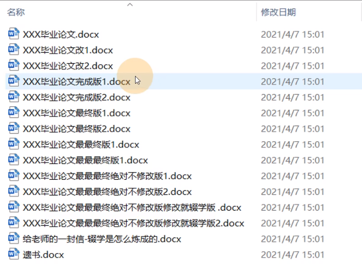
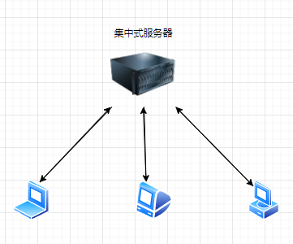
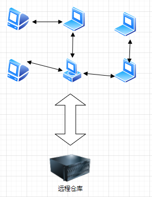

# 认识 Git 

Git 是一个免费的、开源的分布式版本控制系统，可以快速高效处理从小型到大型的各种项目

Git 易于学习，占地面积小，性能极快。它具有廉价的本地库，方便的暂存区和多个工作流分支等特性。其性能优于 Subversion、CVS、Perforce 和 ClearCase 等版本控制工具

### 版本控制

什么是版本控制？版本控制是一种记录文件内容变化，以便将来查阅特定版本修改情况的系统。

如果你想要把文档还原到编辑前的状态，最简单的方法就是备份。但是备份非常麻烦，容易出现一大堆的版本备份，不容易团队之间分享，很难看出各个备份之间的差异，做了哪些修改。如果是团队工作还容易出现冲突，一个人的修改被另一个人覆盖掉，这时候我们需要版本控制

版本控制其实最重要的是可以记录文件修改历史记录，从而让用户能够查看历史版本，方便版本切换



> 为什么需要版本控制？
>
> 个人开发过渡到团队协作


 ### 版本控制工具（集中式 vs 分布式）

**集中式版本控制工具**

CVS、SVN（Subversion）、VSS等

集中式的版本控制系统如CVS、SVN等，都有一个单一的集中管理的服务器，保存所有文件的修改版本，而协同工作的人们都通过客户端连到这台服务器，取出最新的文件或者提交更新。，多年以来，这已成为版本控制系统的标准做法

这种做法带来了很多好处，每个人都可以在一定程度上看到项目中其他人正在做什么。而管理员也可以轻松掌控每个开发者的权限，并且管理一个集中化的版本管理系统，要远比在各个客户端上维护本地数据库轻松容易

缺点是中央服务器的单点故障，如果服务器断网，那么所有都无法工作




**分布式版本控制工具**

GIt、Mercurial、Bazaar、Darcs等

像 Git 这种分布式版本控制工具，客户端提取的不是最新版本的文件快照，而是把代码仓库完整的克隆下来。这样任何一处协同工作用的文件发生故障，事后都可以用其他客户端的本地仓库进行恢复。因每个用户都会有对整个仓库的完整备份

分布式的版本控制解决了集中式版本控制系统的缺陷

1. 服务器断网的情况下也可以进行开发（因为版本控制是在本地进行的）
2. 每个客户端保存的都是整个完整的项目（包含版本信息，更安全）



### Git 历史

1991年，Linus Torvalds（林纳斯·托瓦兹）首次发布了Linux内核开源项目，作为免费开源的项目，LInux有着为数众多的参与者，1991~2002年间，Linux都在手动合并Linux的代码

2002年，BitMover公司愿意授权让Linux社区免费使用BitKeeper这个分布式版本控制系统，

2005年，LInux社区的成员试图破解BitKeeper的协议，被BitMover公司发现，于是BitMover公司收回了Linux社区的免费使用权

Linus向BitMover公司道个歉，保证以后严格管教弟兄们，与此同时Linus 花了两周时间自己用C写了一个分布式版本控制系统，这就是Git！一个月之内，Linux系统的源码已经由Git管理了！

Git迅速成为最流行的分布式版本控制系统，尤其是2008年，GitHub网站上线了，它为开源项目免费提供 Git 存储，无数开源项目开始迁移至 GitHub，包括 jQuery，PHP，Ruby 等等。


# Git 的安装配置

### 安装

在[git官网]https://git-scm.com，下载对应操作系统的版本，git服务器在国外，下载很慢

镜像下载：如淘宝镜像

Windows下载后，直接傻瓜式安装

鼠标`右键`点击看到`Git Bash`和`Git GUI`说安装成功

- Git Bash：Unix和Linux的命令行风格
- Git CMD：Windows命令行风格
- Git GUI：图形用户界面


### Git 配置

**Git 配置文件**

Git 有三个级别的配置文件，每一个级别的配置都会覆盖上层的相同配置

1、Git 系统的配置文件：`Git安装目录下\etc\gitconfig`

```bash
git config --system --list # 查看系统配置文件
```

2、GIt 全局的配置文件：`~\.gitconfig`

```bash
git config --global --list # 查看全局配置文件
```

3、Git 局部的配置文件：`当前项目目录\.git\config`，这里的配置仅仅针对当前项目有效

```bash
git config --list # 查看所有的配置
```

**设置用户名和邮箱**

当你安装好Git后，首先要做的事情就是设置用户名和邮箱，因为Git是分布式控制系统，每台机器都必须有自己的标记。配置的用户信息在每个版本的提交信息中能够看到，没有配置无法提交代码。（这里的用户名和邮箱跟远程仓库的账号没有任何关系）

```bash
git config --global user.name "Your Name" # 设置名称
git config --global user.email "email@example.com" # 设置邮箱
```

想要对某个项目使用不同的名称和e-mail地址，就在项目目录下去掉`--gliabl`重新设置

```bash
$ git config user.name "Your Name" # 设置名称
$ git config user.email "email@example.com" # 设置邮箱
```


# Git 基本概念

Git 本地有三个工作区域：工作目录（Working Directory）、暂存区（Stage/Index）、资源库（Repository），如果加上远程仓库（Remote Directory）就可以分为四个工作区域。文件在这四个区域之间的转换关系

**工作区（Workspace）**

就是你在电脑里能看到的目录，比如我的learn文件夹就是一个工作区

**暂存区（Index/Stage）**

数据暂时存放的区域，可在工作区和版本库之间进行数据的友好交流

**版本库（Repository）**

隐藏文件`.git`就是版本库，里面有你提交到所有版本的数据，Git的版本库里存了很多东西，其中最重要的就是称为stage（或者叫index）的暂存区，还有Git为我们自动创建的第一个分支master，以及指向master的一个指针叫HEAD


**远程仓库**

远程仓库就是代码托管中心，比较常用的：

Github（国外的开源代码托管平台）

Gitee（码云，国内的GIthub）

GitLab（内部使用的GIthub）


**Git 的文件状态**

版本控制就是对文件的控制，先了解一下Git 版本控制下的文件的4种状态：

1）Untracked（未跟踪）

工作区新建的文件，没有添加到版本库，不参与版本管理，可以通过`git add`添加到暂存区

2）Unmodity（未修改）

文件没有修改，文件在版本库和工作区内容不同

3）Modified（文件已修改）

文件已修改，文件在版本库和工作区内容不同

4）Staged（暂存状态）

文件在暂存区


# 使用 Git

**Git 初始化版本库**

想要用Git对项目或者文件进行版本管理，先要初始化版本库。初始化版本库的方法有两种：

1. `git init`初始化
2. 克隆远程仓库

在你想要管理的目录执行`git init`就可以新建一个新的版本库

```bash
git init
```

将远程仓库的项目克隆一份到本地，项目会包含Git的版本信息`.git`

```bash
$ git clone [url]
```

执行后可以看到，仅仅在项目目录多出了一个隐藏目录`.git`，关于版本的所有信息都在这个目录


我们把文件往Git版本库里添加的时候，是分两步执行的：

第一步是用`git add`把文件添加进去，实际上就是把文件修改添加到暂存区；

第二步是用`git commit`提交更改，实际上就是把暂存区的所有内容提交到当前分支。

**添加到暂存区**

```bash
git add <filename>
git add . # 添加目录下所有文件
```


**提交到版本库**

把暂存区的文件提交到版本库

```bash
git commit -m "备注"
git commit -am "备注" # `-a`可以将工作区的文件直接提交到版本库
```


# Git 版本管理

在GIt版本控制中切换版本，底层移动的时`HEAD`指针。`HEAD`指针是当前分支引用的指针，它总是指向该分支上的最后一次提交

开发过程中，我们会提交很多的版本，所有的版本会串成一条时间线，可以使用命令`git reset`穿梭到任意版本Git切换版本可以直接用`HEAD^`回到上一个版本，也可以指定版本号（写前面几位就可以了）

```bash
git reset --hard HEAD^ # 切换回上一个版本，HEAD~3：上3个版本
git reset --hard addf22 
```

如果你不知道版本号可以使用`git log`查看

`git log`命令可以查看最近到最远的提交日志

~~~bash
git log # 详细版本信息
git log --pretty=oneline # 精简版本信息
git log --graph # 分支信息
~~~

使用`git reset`退到之前的版本后，后面的版本信息查看不了，如果在想回到未来的版本，如果命令行窗口还没有被关掉，可以往上找到未来的某个指定版本号。用`git reset --hard 版本号 `回去，如果命令行窗口已经关了，找不到指定的版本号了。可以用`reflog`查看你的命令记录

```bash
git reflog
```


### git reset详解

git reset 通过把分支记录回退几个提交记录来实现撤销改动。你可以将这想象成“改写历史”。git reset 向上移动分支，原来指向的提交记录就跟从来没有提交过一样

`git reset <commit>`

用来回退版本，可以移除后面不在使用的提交，使用不同的参数可以选择影响的范围，以指定是否复原索引或工作区内容

1. `git reset --soft` ：移动版本库的指针HEAD，不更新暂存区和工作区
2. `git reset [--mixed]`：默认，移动版本库的指针HEAD和更新暂存区，不更新工作区
3. `git reset --hard`：移动版本库的指针HEAD和更新暂存区、工作区

文件重置

`git reset HEAD~1 ［文件］`：–soft、–mixed、–hard标记此时不起作用，会更新暂存区，不会更新工作区

~~~bash
git reset a.txt # 它实际上只是将 file.txt 从 HEAD 复制到暂存区
git reset asg3 -- file.txt # 将版本asg3 的file.txt复制到暂存区
git reset HEAD # 把HEAD指向的版本复制到所有暂存区文件，
~~~

### git revert

git revert的用法和git reset一样

~~~bash
git revert HEAD^
git revert add2
~~~

`git revert`被设计为撤销公开的提交(比如已经push)的安全方式，

`git reset`被设计为重设本地更改

git revert是用一次新的commit来回滚之前的commit，git reset是直接删除指定的commit

如：`git revert c2`，撤销revert会用一次新的提交，新提交记录 C2' 引入了更改 —— 这些更改刚好是用来撤销 C2 这个提交的。也就是说 C2' 的状态与 C1 是相同的，

revert更新工作区时，可能需要解决冲突，然后commit


### git cherry-pick

复制提交到当前分支，可以复制一个或多个

~~~bash
git cherry-pick d33h
git cherry-pick 23jj d34f
~~~


**查看文件状态**

可以查看文件的修改状态，提示：`nothing to commit, working tree clean`说明工作区和版本库代码一样

 ```bash
git status [filename] # 查看指定文件状态
git status # 查看所有文件状态
git status -s # -s以精简的方式显示文件状态
git diff # 查看工作区和暂存区的区别
git diff --cached # 查看暂存区和版本库的区别
git diff HEAD # 查看工作区和版本库里面最新版本的区别
git diff --stat # 以精简的方式查看
 ```


# **撤销修改**

### 撤销已经提交的修改（git commit --amend）

有时候我们提交完了才发现漏掉了几个文件没有添加，或者提交信息写错了，此时，可以运行带有 --amend 选项的提交命令来重新提交：

~~~bash
$ git commit --amend
~~~

这个命令会将暂存区的文件提交， 如果自上次提交以来你还未做任何修改（例如，在上次提交后马上执行了此命令）， 那么快照会保持不变，而你所修改的只是提交信息。

文本编辑器启动后，可以看到之前的提交信息。 编辑后保存会覆盖原来的提交信息

如，你发现忘记了暂存一些文件的修改

~~~bash
$ git commit -m 'initial commit'
$ git add forgotten_file
$ git commit --amend
~~~

最终你只会有一个提交——第二次提交将代替第一次提交的结果。

这样的重新提交是完全用一个新的提交覆盖上一个提交，这样可以不用因为一个小失误弄乱仓库版本历史


### 撤销暂存的文件（git restore --staged）

例如，你已经修改了两个文件并且想要将它们作为两次独立的修改提交，但是却意外地输入了 `git add *` 暂存了它们两个。 如何只取消暂存两个中的一个呢？ `git status` 命令提示了你：

~~~bash
$ git status
On branch dev
Changes to be committed:
  (use "git restore --staged <file>..." to unstage)
~~~

想要还原暂存区使用`git restore --staged <file>`，可以把文件移出暂存区，将文件的状态改为unstage，不会改变工作区。Git 版本 2.23.0 引入的一个新命令（推荐使用）

~~~bash
git restore --staged a.txt
~~~

还可以使用`git reset HEAD` 重置暂存区

~~~bash
git reset HEAD
~~~


### 撤销工作区的修改（git restore）

如你修改了工作区，突然发现改错了，想恢复到当前版本库的代码。`git status`会告诉我们使用

~~~bash
$ git status
On branch dev
Changes not staged for commit:
  (use "git add <file>..." to update what will be committed)
  (use "git restore <file>..." to discard changes in working directory)
~~~

Git 版本 2.23.0 引入了一个新命令：`git restore file`，它可以代替`git checkout -- file`的工作

- `git restore file`：版本 2.23.0 引入的新命令（推荐使用）

- `git checkout -- file`


修改后没有添加到暂存区，工作区撤回和版本库一样的状态

修改后已经添加到暂存区，又作了新的修改，工作区撤回到添加到暂存区的版本

~~~bash
git restore a.txt 
git checkout -- file # 或者使用，效果和git restore一样
~~~


# 分支

### 认识分支

Git 的把所有的版本串成一条时间线，这条时间线就是一个分支。Git 默认创建的主分支（master），`HEAD`严格来说不是指向提交，而是指向主分支`master`，`master`才是指向提交的。

开始的时候，`master`分支指向最新的提交，`HEAD`指向`master`分支表示当前分支


当我们创建新的分支（如：dev），Git会创建一个指针`dev`指向最新的提交，在把`HEAD`指向`dev`表示当前分支在`dev`分支上


### 分支基本命令

**查看分支**

~~~bash
git branch # 查看分支
git branch -v # 查看本地分支带上最新提交信息
git branch -vv # 使用参数-vv列出本地分支是否有跟踪远程分支，并且本地分支是否领先或者落后远程分支
git branch -r # 查看远程分支
git branch -a # 查看本地和远程所有的分支
~~~

**创建分支**

这将创建一个指向当前提交的新指针。

~~~bash
git branch <branchName>
~~~

**切换分支**

切换到已经存在的分支下，可以使用`git checkout`

在 Git 2.23 版本中，引入了一个名为 git switch 的新命令，最终会取代 git checkout，因为 checkout 作为单个命令有点超载（它承载了很多独立的功能）

~~~bash
git checkout <branchName>
# or用新命令
git switch <branchName>
~~~

创建分支并立即切换到该分支下

~~~bash
git checkout -b <branchName>
# or
git switch -c <branchName>
~~~

**删除分支**

~~~bash
git branch -d <branchName>
git branch -D <branchName> # 强制删除
git push origin --delete dev # 删除远程分支 
~~~

**修改分支名**

~~~bash
git branch -m oldBranchName newBranchName
git branch -M main
~~~

**合并分支**

~~~bash
git merge <branchName>
git merge --abort # 在分支合并出现冲突时可以使用命令回复到之前为合并状态
~~~

**分支暂存**

在切换分支之前最好先保存当前在暂存区域的内容，使用`git stash`命令将其保存在一个*脏*目录中

~~~bash
git stash # 暂存当前工作状态
git stash # 可以进行多次暂存，查看暂存列表
git stash apply # 重新释放最新的暂存内容
git stash apply <节点名> # 释放指定的暂存节点
git stash clear # 清除所有的暂存节点
~~~


### 分支合并策略

1、`Fast Forward`模式

通常分支合并时，如果可以使用`Fast Forward`模式，就会使用。

现在新建一个`dev`分支做一次提交，`master`分支的状态没有被修改过，`dev`分支包含`master`分支的所有历史记录，这时候合并只需要把master指针移到dev的最新提交上，无需构造新的 commit 节点，这就是`Fast Forward`模式的合并。

~~~bash
git switch -v dev
git commit -m “first”
git switch master
git merge dev
~~~


但这种模式下，删除分支后，会丢掉分支信息。如果想要强制禁止`Fast Forward`模式，可以使用`--no-ff`

~~~bash
git merge dev --no-ff -m “merge dev with no-ff”
~~~

因为本次合并要创建一个新的commit，所以加上-m参数，把commit描述写进去。

执行合并时，如果设定了non fast-forward选项，即使在能够fast-forward合并的情况下也会生成新的提交并合并。


>合并分支时，加上`--no-ff`参数就可以用普通模式合并，合并后的历史有分支，能看出来曾经做过合并，而`fast forward`合并就看不出来曾经做过合并

2、普通模式（Recursive Strategy Merge）

如果mster分支上也有了新的提交，Git无法进行快速合并，只能试图把各自的修改合并起来，但这种合并就可能会有冲突

~~~bash
git merge dev
Auto-merging readme.txt
CONFLICT (content): Merge conflict in readme.txt
Automatic merge failed; fix conflicts and then commit the result.
~~~

如果发生了冲突，我们必须手动解决冲突然后在提交，`git status`也可以查看冲突的文件

Git用`<<<<<<<，=======，>>>>>>>`标记出不同分支的内容，选择需要保留的部分，然后把标记和不需要的删掉然后提交

~~~bash
git add readme.txt
git commit -m "merge dev"
~~~


用`git log --graph --oneline`可以看分支的合并图


### 修复Bug的分支

项目开发中，总是要不停的修复各种Bug，在Git中，可以通过一个新的临时分支来修复，修复后合并分支，然后将临时的Bug分支删除

现在我们要修复一个代号01的Bug，于是创建一个分支`issue-101`，但是我在`dev`分支上的开发还没有完成不想提交，这时候可以用`git stash`先把当前的工作现场（工作区）存储起来

~~~bash
git stash
Saved working directory and index state WIP on master: aeb398b add dev.txt
~~~

这时候用`git status`查看，工作区是干净的，然后我们就可以放心的去修复Bug了

如果要在`master`分支上修复，就在`master`上创建一个临时分支

~~~bash
git switch master
git switch -c issue-01
git merge --no-ff -m "merge issue-01" issue-01
~~~

修复好Bug后，我们回到`dev`分支工作，想要恢复当初的工作区

~~~bash
git stash list # 查看stash
git stash apply stash@{0} # 恢复stash
git stash drop stash@{0} # 删除stash
git stash pop #恢复并删除最近的stash
~~~


同样的Bug在`master`分支上修复了，不需要在`dev`分支上重新合并一次，可以使用


### Feature分支

如果需要开发新的功能，可以新建一个`Feature`分支，开发完合并，然后删除


### rebase

rebase主要有两个作用：

- 合并分支
- 合并提交记录

**合并分支**

rebase和merge一样都可以合并分支，rebase可以让提交变成一条干净的直线，如：

两个并行开发的分支master和experiment


用`git merge experiment`来合并分支

  


用`git rebase`来合并分支

~~~bash
git switch experiment
git rebase master
~~~


`git rebase`会把experiment分支里面的每个commit取消掉，保存成临时文件，然后把experiment分支的指针指向master分支最新的提交，把临时文件合并到experiment分支上生成新的提交，原来的提交（C4）就不见了，回到master分支，进行一次快速合并

~~~bash
git switch master
git merge experiment
~~~


这两种整合方法的最终结果没有任何区别，但是变基使得提交历史更加整洁。 你在查看一个经过变基的分支的历史记录时会发现，尽管实际的开发工作是并行的， 但它们看上去就像是串行的一样，提交历史是一条直线没有分叉


**合并提交记录**

 解决一个问题可能进行了多次提交，但每次提交更改的都比较少，或者是经过反复修改，想在想要将多次提交合并成一个，可以使用交互式rebase

~~~bash
$ git log --oneline --graph
* 5df11cb (HEAD -> dev) version 3.3
* 3ca17b8 version 3.2
* ffd5c01 version 3.1
* f0b15f9 version 3
* 554b5a6 version 2
* 1d3a2b3 version 1
* 1a4ce96 (master) version 4
* 62c8c58 version 3
* 68b1ce1 version 2
* 9c4c216 version 1

git rebase -i HEAD~3 # 修改最近3次提交
# 或者使用区间 git rebase -i [startpoint] [endpoint]，结束区间默认是HEAD指针指向的提交，区间前开后闭
git rebase -i f0b1 # 这也是修改最近的3次提交
# 我们如果需要修改某一个commit,那么就必须指定他的父级commit
~~~

这时候，会自动进入编辑模式

~~~bash
pick cc2108a version 3.1
pick 7dd17dd version 3.2
pick d2c789c version 3.3

# Rebase f0b15f9..d2c789c onto f0b15f9 (3 commands)
#
# Commands:
# p, pick <commit> = use commit
# r, reword <commit> = use commit, but edit the commit message
# e, edit <commit> = use commit, but stop for amending
# s, squash <commit> = use commit, but meld into previous commit
# f, fixup <commit> = like "squash", but discard this commit's log message
# x, exec <command> = run command (the rest of the line) using shell
# b, break = stop here (continue rebase later with 'git rebase --continue')
# d, drop <commit> = remove commit
# l, label <label> = label current HEAD with a name
# t, reset <label> = reset HEAD to a label
# m, merge [-C <commit> | -c <commit>] <label> [# <oneline>]
# .       create a merge commit using the original merge commit's
# .       message (or the oneline, if no original merge commit was
# .       specified). Use -c <commit> to reword the commit message.
#
# These lines can be re-ordered; they are executed from top to bottom.
#
# If you remove a line here THAT COMMIT WILL BE LOST.
#
# However, if you remove everything, the rebase will be aborted.
pick：保留该commit（缩写:p）
reword：保留该commit，但我需要修改该commit的注释（缩写:r）
edit：保留该commit, 但我要停下来修改该提交(不仅仅修改注释)（缩写:e）
squash：将该commit和前一个commit合并（缩写:s）
fixup：将该commit和前一个commit合并，但我不要保留该提交的注释信息（缩写:f）
exec：执行shell命令（缩写:x）
drop：我要丢弃该commit（缩写:d）


~~~

主要是修改提交信息，删除一些没用的提交，合并提交信息（会保留s标记的提交，替代上一个提交，并不会合并内容），调整提交的位置


**rebase的危害**

>一条 rebase 黄金法则：绝不要在公共的分支上使用它。 `git rebase` 会重写历史，一定只能在你自己的分支上使用它


# 远程仓库

为了能团队协作开发项目，我们要使用远程仓库，这些远程仓库一般是Github、Gitee、GitLab这些代码托管中心，也可以是一些私人的服务器。

本地库访问远程仓库需要进行身份验证，在命令行访问像GIthub上的存储库常用两种协议：

HTTPS：需要填写账号密码

SSH：生成密钥对，把公钥部署到Github上

现在我们先在Github上创建一个自己的远程仓库，只需要注册Github就可以免费在上面创建Git的远程仓库


填写Repository name，点击Create repository就创建成功了


这时候，在Github上的`learngit`仓库还是空的。根据Github的提示，我们可以关联本地库和远程仓库来推送（push）代码。

### **添加远程库**

~~~bash
git remote add <别名> <地址>
git remote add learngit git@github.com:Zhongbf/learngit.git
~~~

添加远程库成功后，就可以推送代码了

~~~bash
git push -u learngit master
~~~

这里实际上就是用`git push`命令把`master`分支推动到远程库

由于远程库是空的，我们第一次推送`master`分支时，加上了`-u`参数，Git不但会把本地的`master`分支内容推送的远程新的`master`分支，还会把本地的`master`分支和远程的`master`分支关联起来，在以后的推送或者拉取时就可以简化命令

~~~bash
git push 远程仓库 本地分支名/远程分支名
# 如果需要本地分支和远程分支名一致：git push 远程仓库 本地分支名
git push learngit master
~~~


如果添加的时候地址写错了，或者就是想删除远程库，可以用`git remote rm <name>`命令。使用前，建议先用`git remote -v`查看远程库信息：

**查看远程库**

~~~bash
git remote
git remote -v # -v参数可以列出地址
git remote show learngit # 查看详细信息
~~~

**删除远程库**

此处的“删除”其实是解除了本地和远程的绑定关系，并不是物理上删除了远程库。远程库本身并没有任何改动。要真正删除远程库，需要登录到GitHub，在后台页面找到删除按钮再删除。

~~~bash
git remote rm <别名>
~~~

**重命名远程库**

~~~bash
git remote rename <旧别名> <新别名>
~~~

**跟踪分支**

本地分支跟踪了远程分支，拉取和推送时可以简化命令，如

~~~bash
git push 
git pull
~~~

当克隆一个仓库时，它通常会自动地创建一个跟踪 `origin/master` 的 `master` 分支，使用`git checkout -b [branch] [remotename]/[branch]`也可以，

~~~bash
git switch -c dev origin/dev # 创建dev分支并切换，dev分支会跟踪远程分支origin/dev并拉取代码
# 使用 -u 或 --set-upstream-to 手动跟踪已经本地分支
git branch -u origin/dev
~~~


### 克隆远程库

如果先有本地库，后有远程库，可以先添加远程库在推送代码

但是最常见的是先创建远程库，然后用`git clone`克隆下来，

~~~bash
git clone git@github.com:Zhongbf/Hello-World.git
# 别名默认是origin，自定义可以使用-o
git clone -o <别名> <地址>
# clone默认克隆主分支，想要克隆其他分支，如dev
git clone -b dev <地址>
~~~

如果是团队开发，大家都克隆一份


### 多人协作（push + pull）

当你从远程仓库克隆时，实际上Git自动把本地的`master`分支和远程的`master`分支对应起来了，并且，远程仓库的默认名称是`origin`。

要查看远程库，可以使用`git remote`

~~~bash
$ git remote
origin
~~~

或者用`git remote -v`显示地址

~~~bash
$ git remote -v
origin  git@github.com:Zhongbf/Hello-World.git (fetch)
origin  git@github.com:Zhongbf/Hello-World.git (push)
~~~

上面显示了可以抓取和推送的origin的地址。如果没有推送权限，就看不到push的地址。


**推送分支（push）**

推送分支，就是把该分支上的所有本地提交推送到远程库。推送时，要指定本地分支，这样，Git就会把该分支推送到远程库对应的远程分支上：

~~~bash
git push origin master
~~~

如果要推送其他分支，如`dev`

~~~bash
git push origin dev
~~~

但是，并不是一定要把本地分支往远程推送，那么，哪些分支需要推送，哪些不需要呢？

- `master`分支是主分支，因此要时刻与远程同步；
- `dev`分支是开发分支，团队所有成员都需要在上面工作，所以也需要与远程同步；
- bug分支只用于在本地修复bug，就没必要推到远程了，除非老板要看看你每周到底修复了几个bug；
- feature分支是否推到远程，取决于你是否和你的小伙伴合作在上面开发。


**拉取分支（pull / fetch）**

远程库`clone`时，默认情况会克隆主分支并跟踪，如果想要在远程库的其他分支上开发如`dev`分支

现在我们模仿另一个员工，在其他的

新建本地分支并关联到指定远程分支（并且拉取代码）

~~~bash
git switch -c dev origin/dev # 也可以使用git checkout -b dev origin/dev
~~~

这时候你可以在`dev`分支上开发，然后`push`自己的代码到远程库

~~~bash
git push origin dev 
# 如果已经关联了远程分支，可以直接
git push
~~~

当你推送代码的时候已经有人推动了他的提交，而你修改的文件又发生冲突，会推动失败。解决办法也很简单，Git已经提示我们，先用git pull把最新的提交从origin/dev抓下来，然后，在本地合并，解决冲突

~~~bash
git pull origin dev 
# 如果已经关联了远程分支，可以直接
git pull
~~~

手动解决冲突，然后提交，在`push`


`git fetch`也可以拉取分支，但是用`fetch`只会以副本的形式放在版本库，它并不会修改工作目录中的内容，需要你用手动合并`git merge`

所取回的更新，在本地主机上要用"远程主机名/分支名"的形式读取。比如origin主机的master，就要用`origin/master`读取

~~~bash
git fetch origin dev
# 拉取分支更新后，需要手动合并
git merge origin/dev
~~~

`git pull`会直接合并到工作区，相当于先做`git fetch`然后`git merge`


# 标签管理

Git 可以给历史中的某一个提交打上标签，以示重要。 比较有代表性的是人们会使用这个功能来标记发布结点（v1.0 等等）

> 标签是和commit绑定的

**查看标签**

这个命令以字母顺序列出标签

~~~bash
git tag
git tag -l 'v1.8.5*' # 	特定的模式查找标签，这是查找v1.8.5开头的标签
git show v1.0 # 查看详细标签信息
~~~

**创建标签**

创建标签很简单，切换到需要打标签的分支上，默认在HEAD指针指向commit上

~~~bash
git tag v1.0
~~~

如果要为以前的提交创建标签，可以用`git log`查看commit_id

~~~bash
git log --oneline
7b8dd7b (HEAD -> dev, tag: v1.0) add a.txt
37a19fc version 3
68b1ce1 version 2
9c4c216 version 1
~~~

然后指定对应的commit_id

~~~bash
git tag v2.0 68b1
~~~

还可以创建带有说明的标签

~~~bash
git tag -a v3.0 -m "version 3.0" [commit_id]
~~~

**删除标签**

~~~bash
git tag -d v1.0
~~~

删除远程标签

~~~bash
# 先从本地删除
git tag -d v1.0
# 然后推动到远程
it push origin :refs/tags/v1.0
~~~


**推送标签到远程仓库**

默认情况下，`git push` 命令并不会传送标签到远程仓库服务器上。 在创建完标签后你必须显式地推送标签到共享服务器上

~~~bash
git push origin v1.0
git push origin --tags # 推送全部标签
~~~


# 忽略特殊文件

有些时候，你必须把某些文件放到Git工作目录中，但又不能提交它们，比如保存了数据库密码的配置文件啦，等等，每次`git status`都会显示`Untracked files ...`，有强迫症的童鞋心里肯定不爽。

好在Git考虑到了大家的感受，这个问题解决起来也很简单，在Git工作区的根目录下创建一个特殊的`.gitignore`文件，然后把要忽略的文件名填进去，Git就会自动忽略这些文件。

不需要从头写`.gitignore`文件，GitHub已经为我们准备了各种配置文件，只需要组合一下就可以使用了。所有配置文件可以直接在线浏览：https://github.com/github/gitignore


# 配置别名

Git 并不会在你输入部分命令时自动推断出你想要的命令。 如果不想每次都输入完整的 Git 命令，可以通过 `git config` 文件来轻松地为每一个命令设置一个别名

我们只需要敲一行命令，告诉Git，以后`st`就表示`status`：

~~~bash
git config --global alias.st status
~~~

` --global`表示对当前用户有效，如果不加，那只针对当前的仓库起作用。

要删除别名到配置文件删除即可

~~~
[user]
	name = zhongbf
	email = zhongbf10@163.com
[filter "lfs"]
	clean = git-lfs clean -- %f
	smudge = git-lfs smudge -- %f
	process = git-lfs filter-process
	required = true
[core]
	autocrlf = false
[http]
	sslVerify = false
[credential]
	helper = wincred
[alias]
	log = log --color --graph --pretty=format:'%Cred%h%Creset -%C(yellow)%d%Creset %s %Cgreen(%cr) %C(bold blue)<%an>%Creset' --abbrev-commit
