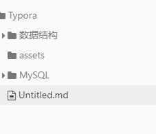
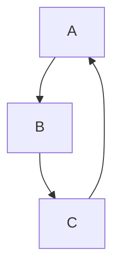
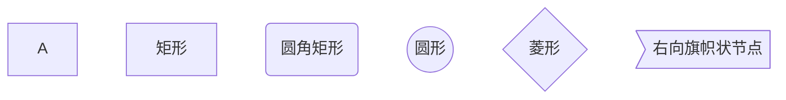
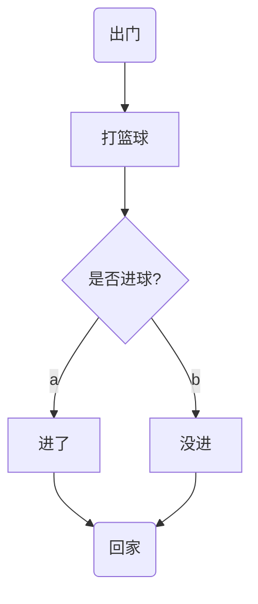
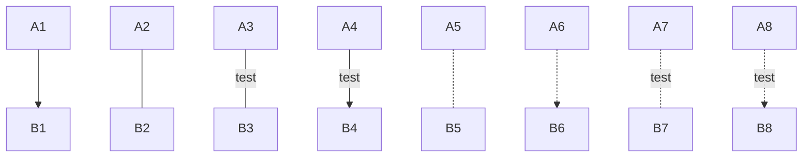
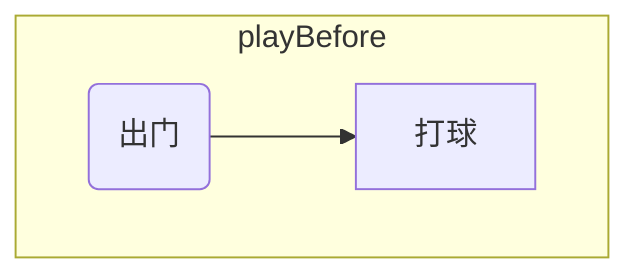

# MarkDown 基础

## 标题

### 

> #标题名字，#的个数代表标题的级数，最多支持六级标题

```
# 一级标题
## 二级标题
### 三级标题
#### 四级标题
##### 五级标题
###### 六级标题
```


## 文字

```
删除线：~~删除线~~
斜体：*斜体*
加粗：**加粗**
下划线：<u>下划线</u>
高亮：==高亮==
下标：H~2~O~2~
上标：m^2^
```

删除线：~~删除线~~
斜体：*斜体*
加粗：**加粗**
下划线：<u>下划线</u>

高亮：==高亮==

下标：H~2~O~2~
上标：m^2^


## 表情符号

> Emoji表情符号，使用`:`	快捷键：`Ctrl`+`SHIFT`+`B`

```
表情符号：:smile:	:laughing:
```

:smile:	:laughing:


## 表格

> 用`|`来分隔不同的单元格，使用`-`来分隔表头和其他行，`:`标记对齐方式

```
name | age
--- | :---:
Kobe | 24
```

| name | age  |
| ---- | :--: |
| Kobe |  24  |

最好使用快捷键`CTRL`+`T`


## 引用

```
>引用
>>引用嵌套
```

>引用
>>引用嵌套


## 列表

### 无序列表

```
可以使用`*`或者`-`或者`+`
- 用-
- 用+
- 用*
```

- 用`-`
- 用`+`
- 用`*`

### 有序列表

```
有序列表以数字+`.`开始
1. 1.+ 空格
2. 退出列表按两次Enter
```

1. 有序列表
2. 有序列表
3. 有序列表


## 代码

### 代码块

```
```语言名称
`行内代码`
```


## 分割线

可以使用三个或者更多的`*`、`-`、`_`来添加分隔线

```
***
---
___
```

***
---
___


## 跳转

> 不要省略协议，写完全部协议，使用`CTRL`+ 点击来实现跳转

```超链接：
超链接：[百度](https://www.baidu.com);
自动转换为超链接：<https://www.baidu.com>
文件内跳转：[去列表](#标题)
```

超链接：[百度](https://www.baidu.com)

自动转换为超链接：<https://www.baidu.com>

文件内跳转：[去列表](#列表)


## 图片

```

```




## 流程图（graph）

MarkDown 是轻文本编辑器，只能画简单的流程图

Mermaid 是一个用于画流程图、状态图、时序图的库，Typora支持，生成的不是一个“图片”，而是一段HTML代码

```
语法：
```mermaid
graph TB;
	A-->B
	B-->C
	C-->A
方向：TB——从上到下；BT——从下到上；RL——从左到右；LR——从右到左
B[矩形节点]
```




### 流程图常用的符号和含义

##### 节点形状

| 语法       | 说明           | 含义                                 |
| :--------- | -------------- | ------------------------------------ |
| ID[文字]   | 矩形节点       | 表示过程，也就是整个流程中的一个环节 |
| ID(文字)   | 圆角矩形节点   | 表示开始和结束                       |
| ID((文字)) | 圆形节点       | 表示连接                             |
| ID{文字}   | 菱形节点       | 表示判断                             |
| ID>文字]   | 右向旗帜状节点 |                                      |

> ID即为节点的唯一标识，A~F是当前节点名字
>
> 括号内是节点中要显示的文字，默认节点的名字和显示文字都是ID

```
graph TB
	A
	B[矩形]
	C(圆角矩形)
	D((圆形))
	E{菱形}
	F>右向旗帜状节点]
```






#### 连线

```
graph TB
	A1-->B1
	A2---B2
	A3--test--B3
	
	A4--test-->B4
	A5-.-B5
	A6-.->B6
	A7-.test.-B7
	A8-.test.->B8	
```

> 可以用`=`代替`-`




#### 子图表

语法

```
graph TB
	subgraph 打球前
		begin(出门)--> playBasketball[打球]
	end
```




## 序列图

画图没意思，用软件画了


# 换主题

