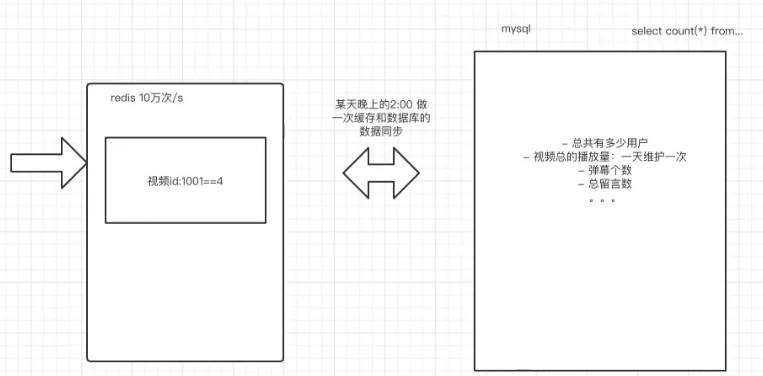

# 一、索引的概述

### 1.1. 为什么要使用索引索引

> 在海量的数据中进行查询某条记录的场景是经常发生的，那么如何提升查询性能，就跟要查询的数据字段是否有索引有关系。如果字段加了索引，那么查询的性能就非常快！——就是为了快

- 索引为什么快
- 索引到底是什么
- 在使用索引时要注意什么


### 1.2. 索引是什么

> 查字典的方式？通过目录可以快速的定位到目标数据的页码。索引就相当于字典的目录
>
> 没有使用索引的时候，数据的查询需要进行多次I/O读写，这样数据库的性能很差——全表扫描过程


为数据库的某个字段创建索引，相当于为这个字段的内容创建了一个目录。通过这个目录可以快速的实现数据的定位

现在的疑问？

- 索引存放位置
- 索引的分类及如何创建
- 索引使用了那种数据结构：各种数据结构的查询性能进行分析


### 1.3. 索引存放的位置

> 对于mac系统在/usr/local/mysql文件夹中，对于windows系统C:\ProgramData\MySQL（隐藏文件夹）

- InnoDB存储引擎的表：将索引和数据存放在同一个文件里 `表名.ibd`。（为什么？有什么优势？）

- MyISAM存储引擎的表：索引和数据分开两个文件来存储。索引：`*.MYI`； 数据：`MYD`


### 1.4. 索引的分类

- `主键索引`：主键自带索引效果，也就意味着 通过主键来查询表中的记录，性能好
- `普通索引`：为普通列创建的索引
- `唯一索引`：为唯一列创建的索引，通过给列添加unique约束会自动添加唯一索引
- `联合索引（组合索引）`：一次性为表中的多个字段一起创建索引，最左前缀法则（如何命中联合索引中的索引列。注意：一个联合索引最好不要超过5个列）
- `全文索引`：进行查询的时候，数据源来自于不同字段或者不同的表，通过关键字进行匹配。比如百度查询，在实际项目中，并不会使用MySQL提供的全文索引功能来实现全文查找，而是会使用第三方的搜索引擎中间件

```SQL
-- 创建普通索引
create index <索引名称> on <表名(列名)>; -- 语法
create index idx_name on tb_testindex(name); -- 实例

-- 创建唯一索引
create unique index <索引名称> on <表名(列名)>; -- 语法
create unique index idx_tid on tb_testindex(tid); -- 实例

-- 创建联合索引
create index <索引名称> on <表名(列1,列2,列3....)>; -- 语法
create index idx_tid_name_remark on tb_testindex(tid,name,remark); -- 实例
```


# 二、索引的数据结构

> 索引的数据结构是方便查询的数据结构
>
> 数据结构是指相互之间存在一种或多种特定关系的数据元素集合（数组、链表、栈、堆、队列等等等）

数据逻辑结构（逻辑关系是指数据之间的前后间关系）

1. 集合：数据结构中的元素之间除了“同属一个集合” 的相互关系外，别无其他关系
2. 线性结构：数据结构中的元素存在一对一的相互关系；
3. 树形结构：数据结构中的元素存在一对多的相互关系；
4. 图形结构：数据结构中的元素存在多对多的相互关系。

数据的物理结构（逻辑结构在计算机内的存储方式）

1. 顺序存储
2. 链式存储
3. 索引存储
4. 散列存储

### 2.1. 线性表

> 线性表是具有相同特性的数据元素的一个有限序列，有且仅有一个起始结点和终端结点，其他结点也只有一个前趋和一个后继

对于线性表来说，有两种存储结构（物理结构）

- 线性顺序表：相邻两个数据的逻辑关系和物理位置是相同的。
- 线性链式表：相邻两个数据的逻辑关系和物理关系存放位置没有关系。数据是有先后的逻辑关系，但是数据的物理存储位置并不连续，用指针来维护链表的逻辑关系
  - 单向链表：能够通过当前结点找到下一个节点的位置，以此来维护链表的逻辑关系；节点结构（数据内容 + 下一个数据的指针）
  - 双向链表：能够通过当前节点找到上一个或下一个节点的位置，双向都可找，结点结构（上一个数据的指针+数据内容+下一个数据的指针）

**顺序表和链式表的区别：**

- 顺序表（数组）：顺序表得查询性能非常好：时间复杂度O(1)；顺序表得增删性能很差
- 链式表：查询的性能非常差：时间复杂度O(n)，增删性能非常好

### 2.2 栈、队列、串、广义表

**栈（Stack）**

- 栈（stack）是一个特殊的线性表，是限定仅在一端（通常是表尾）进行插入和删除操作的线性表

  又称为后进先出（Last In First Out）的线性表，简称LIFO结构

**队列（Queue）**

- 队列（queue）是一种先进先出（Frist In Frist Out——FIFO）的线性表

  在表一端插入（表尾），在另一端（表头）删除

**串（String）**

- 零个或多个任意字符组成的有限序列

**广义表**

- 更加灵活的多维数组，可以在不同的元素中创建不同的维度的数组

### 2.3 树（Tree）

> 树（Tree）：n（n≥0）个结点的有限集，有且仅有一个根结点，其余结点均使根的子树

#### 2.3.1 多叉树（普通树）

非二叉树

#### 2.3.2 二叉树

每个结点最多有俩孩子（二叉树中不存在度大于2的结点），子树有左右之分，其次序不能颠倒

#### 2.3.3 二叉查找树（又称二叉排序树、二叉搜索树）

二叉排序树或是空树，或是满足如下性质的二叉树

- 若其左子树非空，则左子树上所有节点的值均小于根结点的值
- 若其右子树非空，则右子树上所有结点的值均大于等于根结点的值
- 其左右子树本身又各是一颗二叉排序树


#### 2.3.4 平衡二叉树（理想概念的树）

含有n个结点的二叉排序树的平均查找长度和树的形态有关，如何如何提高形态不均衡的二叉排序树的查找效率？——平衡二叉树

平衡二叉树又称AVL树（Adelson-Velskii and Landis），它或者是空树，或者是具有以下性质的二叉查找树

- 左子树与右子树的高度只差的绝对值小于等于1
- 左子树和右子树也是平衡二叉排序树

查找二叉树和平衡二叉树的转化：

#### 2.3.5 红黑树（平衡二叉树的一种体现）

红黑树是一种特化的AVL树（平衡二叉树），都是在进行插入和删除操作时通过特定的操作保持二叉查找树的平衡，从而获得较高的查找性能

平衡二叉树为了维护树的平衡，在一旦不满足平衡的情况就要进行自旋，但是自旋会造成一定的系统开销，因此红黑树在自旋造成的系统开销和减少查询次数之间做了权衡，因此红黑树有时候并不是一个平衡二叉树。


红黑树已经是在查询性能傻瓜得到了优化，但索引依然没有使用红黑树作为数据结构来存储数据，因为红黑树在每一层上存放的数据内容是有限的，导致数据量一大，树的深度就变得非常大，于是查询性能非常差，因此索引没有使用红黑树

#### 2.3.5 B树（B-tree，BTree）

B树允许一个结点存放多个数据。这样可以减少树的深度，但是B树的一个结点中到底能存放多少个数据，决定了树的深度，MySQL默认情况下一个结点的大小是16K，如果数据太多，B树的深度还是会很大，B树的范围查找性能不高


#### 2.3.6 B+树

B+树：

- 非叶子结点冗余了叶子结点中的数据
- 叶子节点是从小到大、从左到右排列的
- 叶子结点之间提供了指针，提高了区间访问的性能
- 只有叶子结点存放数据，非叶子结点不存放数据，只存放键（可以说是叶子结点的索引）


B+树的非叶子结点只需要存放索引的键，这样B+树每个结点能存放更多的数据，树的层级比B树大大较少

B+树可以通过根结点搜索，也可以通过叶子结点的指针搜索，提高了二次查询（第一次查询ID=1从树根结点查询出结果，第二次查询ID=2就可以通过叶子结点的指针查询）和区间查询的效率

**为什么使用B+树做数据库索引？**

1. B+树的层级更少：相较于B树B+每个非叶子节点存储的关键字数更多，树的层级更少所以查询数据更快；
2. B+树查询速度更稳定：B+所有关键字数据地址都存在叶子节点上，所以每次查找的次数都相同所以查询速度要比B树更稳定;
3. B+树天然具备排序功能：B+树所有的叶子节点数据构成了一个有序链表，在查询大小区间的数据时候更方便，数据紧密性很高，缓存的命中率也会比B树高
4. B+树全节点遍历更快：B+树遍历整棵树只需要遍历所有的叶子节点即可，，而不需要像B树一样需要对每一层进行遍历，这有利于数据库做全表扫描


### 2.4 哈希表

使用哈希表来存取数据的性能是最快的（O(1)）,但是不支持范围查找（区间访问）


# 三、InnoDB和MyISAM的区别

> InnoDB和MyISAM都是数据库表的存储引擎。在项目中，或者追求查询性能的场景下，都会使用InnoDB作为表的存储引擎；为什么？


### 3.1 InnoDB引擎

把索引和数据存放在一个文件中，通过找到索引后就能直接在索引树上的叶子结点中获得完整的数据——聚簇索引

支持事务处理

支持行锁、表锁和外键约束

场景：

- 适合用在高并发读写、需要事务操作、行锁


### 3.2 MyISAM存储引擎

把索引和数据存放在两个文件中，查找到索引后还要其另一个文件找数据，性能会慢一些。——非聚簇索引

MyISAM是MySQL默认的引擎，它的设计目标是快速读取，因为它保存了表的行数，当使用COUNT统计时不会扫描全表

优点：查询数据相对较快，适合大量的select，可以全文索引。

缺点：

- 不支持事务

- 不支持行级锁和外键
- 仅支持表锁

场景：

不需要事务操作，大量的读数据，少插入、少更新


# 四、索引常见的面试题

1、为什么非主键索引的叶子结点存放的数据是主键值？

- MySQL的InnoDB存储引擎会自动为主键建立聚簇索引，非主键索引（也叫列索引、辅助索引、二级索引）在B+树的叶子结点存放的不是地址指针，而是数据主键值。通过非主键索引检索数据的时候，会先通过检索列的值找到列的主键，在通过主键索引获取最终的值，需要检索2次索引

  这样设计当数据被大量DML导致页分裂或数据库发生迁移，不用重新维护索引

- MySQL的MyISAM存储引擎用的是非聚簇索引，主键索引和其他索引都是在B+树的叶子结点存储地址指针

2、为什么InnoDB表必须创建主键？

- 聚簇索引默认是主键，如果表中没有定义主键，InnoDB 会选择一个唯一的非空索引（确切说会选择一个唯一非空的列作为主键）代替。如果没有这样的索引，InnoDB 会隐式定义一个主键来作为聚簇索引，聚簇索引性能最好也是唯一的，主键的性质最适合（不可重复、不可为空、递增排序）

3、为什么使用主键推荐使用整性的自增主键

- 因为聚簇索引使用的B+树结构，会在叶子结点顺序的存储数据，如果使用的主键随机稀疏（1，99，344，88.....），会导致插入数据时频繁的产生页分裂和主键稀疏导致的空间浪费，使用自增主键，那么每次插入新的记录，记录就会顺序添加到当前索引节点的后续位置


# 五、联合索引和最左前缀法则

### 5.1 联合索引

> 使用一个索引来实现多个表中字段的索引效果

**联合索引是如何存储的**


### 5.2 最左前缀法则

> 最左前缀法则表示一条SQL语句在联合索引中有没有走索引（命中索引/不会全表扫描）

```sql
-- 创建联合索引
create index idx_a_b_c on table1(a,b,c);
-- sql语句有没有命中索引
select * from table1 where a = 10; -- 命中索引
select * from table1 where a = 10 and b = 20; -- 命中索引
select * from table1 where a = 10 and b = 20 and c = 30; -- 命中索引
select * from table1 where b = 20; -- 未命中索引
select * from table1 where b = 20 and c = 30; -- 未命中索引
select * from table1 where a = 20 and c = 30; -- 命中索引
select * from table1 where c = 30; -- 未命中索引
select * from table1 where a = 10 and b = 20 and c = 30; -- (a,b,c全走=>mysql优化器会自动优化)
```


# 六、SQL优化

> SQL优化的目的是为了SQL语句能够具备优秀的查询性能，实现这样的目的有很多途径：
>
> - 工程优化：数据库标准、表的结构标准、字段的标准、创建索引
> - SQL语句的优化：当前SQL语句有没有命中索引

### 6.1 工程优化

参考《MySQL 军规》

### 6.2 Explain 执行计划——SQL优化神器


#### 6.2.1 Explain的介绍

在完成工程结构的优化之后，数据库、数据表、字段及索引，du'neng'gou支持海量数据的快速查找。但是查找依然需要通过SQl语句来实现，因此性能优秀的SQL语句是能够走索引，快速查找到数据的。性能不好的SQL语句，就不会走索引，导致全表扫描

找到哪些SQL是慢SQL的方法：一种是开启本地MySQL的慢日志查询日志；另一种是阿里云提供的RDS（第三方部署的MySQL服务器）提供了查询慢SQL的功能

阿里云rds提供了慢SQL的查询功能。找到慢SQL后，如何做优化，以及如何查询一条SQL语句是否是慢SQL，那就可以通过Explain工具。

在 select 语句之前增加 explain 关键字，MySQL 会在查询上设置一个标记，执行查询时，会返回执行计划的信息，而不是执行这条SQL（如果 from 中包含子查询，仍会执行该子查询，将结果放入临时表中）

~~~sql
explain select * from tb_testindex where name like '%name%'; 
show warnings; -- 查看优化
~~~

在查询中的每个表会输出一行，如果有两个表通过  JOIN 连接查询，那么会输出两行。表的意义相当广泛：可以是子查询、一个 union 结果等。


 

#### 6.2.2 Explain的列

| 字段         | 含义                     |
| ------------ | ------------------------ |
| id           | 该语句的唯一标记         |
| select_type  | 查询类型                 |
| table        | 表名                     |
| partitions   | 匹配的分区               |
| type         | 连接类型                 |
| possible_key | 可能的索引选择           |
| key          | 实际选择的索引           |
| key_len      | 索引的长度               |
| ref          | 索引的那一列被引用了     |
| rows         | 估计要扫描的行           |
| filtered     | 表示符合查询条件的百分比 |
| Extra        | 附加信息                 |

**id列**

每个select语句都会自动分配一个唯一标记符，如果多个id值，数字越大，执行优先级越高，id相同，则从上往下执行，id列为null表示为结果集，不需要使用这个语句来查询

**select_type 列**

查询类型，主要用于区分普通查询和复杂查询（复杂查询分为三类：简单子查询、派生表（from语句中的子查询）、union 查询）

- simple

  - 不包含子查询和union查询

  ~~~sql
   explain select * from students where stu_id=1;
  ~~~

  

- primary：一个需要使用union的操作或者含有子查询的select，位于最外层的单位查询的select_type即为
  primary，且只有一个 

- subquery：包含在 select 中的子查询（不在 from 子句中）

- derived：包含在 from 子句中的子查询。MySQL会将结果存放在一个临时表（派生表、衍生表），

  ~~~sql
  /* MySQl5.7版本开始使用了Merge Derived table 优化，查询类型变为SIMPLE,默认开启，关闭后才能看见derived */
  set session optimizer_switch='derived_merge=off'; -- 关闭优化
  explain select (select 1 from students where stu_id=1) from (select * from students where stu_id=1) der;
  ~~~

  

- union：在 union 中的第二个和随后的 select

- union result：union的结果

  ~~~sql
  explain select 1 from students union select 2 from books;
  ~~~

  


**table 列**

表示当前这一行正在访问哪张表，如果SQL定义了别名，则展示表的别名

**type 列** 

type可以直观的判断出当前的SQL语句的性能，type里的取值和性能的优劣顺序如下

~~~
null > system > const >eq_ref > ref > range > index > all
~~~

对于SQL优化来说，要尽量保证type列的值是属于range及以上级别

- null：性能最好的，一般在使用聚合函数操作索引列，结果直接从索引树获取即可，不用查询记录

  ~~~SQL
  explain select min(book_id) from books;
  ~~~

- system：查询的表只有一条记录或者是空表，一般在临时表里，是const的特殊情况

  ~~~SQL
  explain select * from (select * from students where stu_id=1) der;
  ~~~

- const：针对主键或唯一索引的等值查询扫描, 最多只返回一行数据. 

  ~~~SQL
  explain select 1 from students where stu_id=1
  ~~~

- eq_ref：在连表查询时，连接条件是使用表的主键索引或唯一索引

- ref

  - 在简单查询时，查询条件是使用联合索引或普通索引
  - 在连表查询时，连接条件是使用联合索引或普通索引

- range：使用索引进行范围查找

  ~~~sql
  explain select * from tb_testindex where sid < 2;
  ~~~

- index：查询没有进行条件判断，但是所有的数据都可以直接从索引树上获取（所有列都有索引，不能是联合索引）

  ~~~sql
  explain select stu_id from students;
  ~~~

- all：没有走索引，进行了全表扫描


**possible_key列**

这一次查询可能用到的索引，mysql内部优化器会进行判断这次走索引的性能如果比全表扫描的性能要差，那么内部优化器会让这么查询进行全表扫描——可以通过trace工具来查看

**key**

实际该SQL语句使用的索引

**rows列**

该SQL语句可能要查询的数据条数

**key_len列**

索引的长度，通过这一列可以让我们知道当前命中了联合索引中的那几列

计算规则

~~~
- 字符串
1. char(n):n字节长度
2.varchar(n)：2字节存储字符串长度，如果是utf-8，则长度为3n + 2

- 数值类型
1. tinyint：1字节
2. smallint：2字节
3. int：4字节
4. bigint：8字节

- 时间类型
1. date：3字节
2. timestamp：4字节
3. datetime：8字节

如果字段允许为NULL，需要1字节记录是否为NULL
索引最大长度是768字节，当字符串过长时，mysql会做一个类似最左前缀索引的处理，将前半部分的字符提取出来做索引
~~~

**extra列**

extra列提供额外的信息，是能够帮助我们判断当前sql是否使用了覆盖索引、文件排序、使用索引进行条件查询等等的信息

- Using index：使用了覆盖索引，性能好

  所谓的覆盖索引，指的是当前查询的所有数据字段都是索引列，这就意味着可以直接从索引列中获取数据，而不需要进行查表（非聚簇索引避免进行二次索引，直接在索引树获取），当有不能覆盖到的列时，可以使用联合索引

  ~~~sql
  explain select stu_num from students; -- 覆盖索引
  explain select stu_num,stu_name from students; -- 没有使用覆盖索引
  ~~~

- Using where：使用了where做条件查询（主键等值查询是null）

  ~~~sql
  explain select * from students where stu_num > 1;
  ~~~

- Using index condition：确实命中了索引，但不是所有的列数据都在索引树上，还需要访问实际的行记录。

  ~~~sql
  
  ~~~

- Using temorary：在非索引列上进行去重操作就需要使用一张临时表来实现，性能是非常差的

  ~~~sql
  explain select distinct stu_name from students; -- stu_name字段没有索引
  ~~~

- Using  filesort：使用文件排序，会使用磁盘+内存的方式进行文件排序，会涉及到两个概念：单路排序、双路排序

  ~~~sql
  explain select * from students order by stu_num; 
  ~~~

- Select tables optimized away：直接在索引列上进行聚合函数的操作


注意：

- 不能再索引列上做计算、函数、类型转换

- 日期查询换成范围查找

  ~~~sql
  explain select * from table1 date(create_time)='2000-02-02'
  -- 换成
  explain select * from table1 where create_time>='2000-02-02 00:00:00' and create_time <=2022-02-02 59:59:59
  ~~~

- 尽量使用覆盖索引

- 使用不等于（!=或者<>）、is null、is not null会导致全表扫描

- 使用like以通配符开头（%abc）会导致全表扫描

- 字符串不加单引号会导致全表扫描

- 少用 in 和 or MySQL内部优化器可能不走索引


### 6.3 MySQL的内部优化器

 在SQl查询开始之前，MuSQL内部优化器会进行一次自我优化，让这一次的查询性能尽可能的好

当前执行的SQl

~~~sql
explain select * from logs where id = 1; 
show warnings;
~~~

内部优化后的语句

~~~sql
/* select#1 */ select '1' AS `id`,'2022-03-09 22:40:28' AS `time`,'添加202210学生' AS `log_text` from `db_test3`.`logs` where true
~~~


### 6.4 Trace工具

> 在执行计划中我们发现有的SQL会走索引，有的SQL即使明确使用了索引页不会走索引。这是因为MySQL优化器认为走索引的性能比不走索引全表扫描的性能要差，因此MySQL内部优化器选择了使用全表扫描，依据自于trace工具的分析

~~~sql
set session optimizer_trace="enabled=on",end_markers_in_json=on; -- 开启trace
explain select * from tb_testindex where name = 'test_name4499024'; -- 执行查询
select * from information_schema.OPTIMIZER_TRACE; -- 获得trace分析结果
~~~


# 七、SQL优化实战

### 7.1 Order by优化

> 在Order by中，如果排序会造成文件排序（在磁盘中完成排序，这样的性能会比较差），那么就说明sql没有命中索引，怎么解决？可以使用最左前缀法则，让排序遵循最左前缀法则，避免文件排序

~~~sql
-- using filesort
explain select * from tb_testindex where tid = '1000000' order by remark; 
-- 没有使用文件排序
explain select * from tb_testindex where tid = '1000000' order by name,remark; 
-- 不满足最左前缀法则 ，使用了文件排序
explain select * from tb_testindex where tid = '1000000' order by remark,name; 
-- 满足最左前缀法则 ，使用了索引排序
explain select * from tb_testindex where tid = '1000000' and name='test_name' order by remark,name; 
-- 排序方向不同，没有使用索引排序 Backward index scan
explain select * from tb_testindex where tid = '1000000' and name='test_name' order by name,remark desc; 
-- 使用了范围查询，使用了文件排序
explain select * from tb_testindex where tid in(100000,1000001) order by name,remark; 
-- 使用了范围查询，使用了文件排序
explain select * from tb_testindex where tid > 1000000 order by name,remark; 
~~~

优化手段：

- 如果排序的字段创建了联合索引，那么尽量在业务不冲突的情况下，遵循最左前缀法则来写排序语句
- 如果文件排序无法避免，那么尽量想办法使用覆盖索引。


### 7.2 Group by优化

Group by 的原理使先排序后分组，因此对于group by 的优化参考order by 


### 7.3 文件排序的原理

在执行文件排序的时候，会把查询的数据的大小与系统变量：`max_length_for_sort_data`的大小进行比较（默认是`1024`字节）

如果`max_length_for_sort_data`大于查询字段的总长度，执行单路排序

如果`max_length_for_sort_data`小于查询字段的总长度，执行双路排序

**单路排序**

- 把所有的数据放到`sort_butter`内存缓冲区中，进行排序，然后结束

**双路排序**

- 取数据的排序字段和主键字段，在内存缓冲区中排序完成后，将主键字段做一次回表查询，获取完整的数据

 


### 7.4 分页优化

**案例一**

```sql
-- 一次性获取10010，在舍弃掉前10000条
explain select * from tb_testindex limit 10000,10;
-- 逐渐连续的情况下，可以用主键来做条件（不常用）
explain select * from tb_testindex where fid>10000 limit 10;
```

**案例二**

```sql
-- 全表扫描，做文件排序
explain select * from tb_testindex order by tid limit 100000,10;
-- 先进行覆盖索引的查找，避免文件排序，然后再连表扫描拿数据，
explain select * from tb_testindex a inner join (select fid from tb_testindex order by tid limit 100000,10) b on a.fid=b.fid;
```


### 7.5 Join优化

在`join`中会涉及到大表（数据量大）和小表（数据量小）的慨念。MySQL内部优化器会根据关联子段是否创建索引使用不同的算法：

-  NLJ（嵌套循环算法，Nested Loop Join ）：如果关联字段使用了索引，MySQL会对小表做全表扫描，用小表的数据去和大表的数据去做索引字段的关联查询（type：ref）；跟关联的两个表的位置无关
- BNLJ（块嵌套循环算法，Block Nested Loop Join）：如果关联字段没有使用索引，MySQL会提供一个`join buffer`缓冲区，先把小表放到缓冲区中，然后全表扫描大表，把大表的数据和缓冲区中的小表数据在内存中进行匹配

> 结论：使用`join`查询时，一定要建立关联字段的索引，且两张表的关联字段在设计之初就要	做到字段类型、长度是一致的，否则索引失效


### 7.6 in 和 exsits

在sql中如果A表是大表，B表是小表，那么使用`in`；反之使用`exists`

**in**：B表的数据量 < A表的数据量

```sql
select * from A where id in (select id from B);
-- 相当于
for(select id from B) {
	select * from A where A.id=B.id;
}
```

**exists**：B表的数据量 > A表的数据量

```sql
select * from A where exists (select 1 from B where B.id = A.id)
-- 相当于
for(select * from A){
	(select * from B where B.id = A.id;
}
```


### 7.7 count 优化

```sql
select count(1) from tb_testindex; -- 1.076s
select count(*) from tb_testindex; -- 1.020s
select count(fid) from tb_testindex; -- 1.023s
select count(sid) from tb_testindex; -- 0.8s
```

对于count的优化应该是架构层面的优化，因为count的统计是在一个产品中被频繁访问的数据，所以对于访问频率过高的数据建议维护在缓存中（如：redis）




# 八、锁的定义和分类

> 数据库上加锁是为了保证数据库的一致性
>
> MySQL的MyISAM只支持表锁，InnoDB支持表锁和行锁，DBD支持页锁和表锁

###  8.1 锁的定义

锁是用来解决多个任务（线程、进程）并发访问同一共享资源时带来的数据安全问题，但是会带来性能的影响，频繁使用锁的程序性能是不好的。

对于MySQL来说，必然会遇到任务的并发访问。MySQL怎样在数据安全和性能之间做权衡？—— MVCC设计思想


### 8.2 锁的分类

**从性能上划分：乐观锁和悲观锁**

- 悲观锁：悲观的认为当前的并发很严重，任何时候操作数据（读和写）都是互斥的，每次操作都会上锁。保证了数据的安全，牺牲了性能（如：行锁、表锁、读锁、写锁，都是操作之前先上锁）
- 乐观锁：乐观的认为当前的并发不严重，读数据的时候认为数据不会被修改，不会上锁，大家都可以读，写数据的时候再上锁

**从锁粒度划分：表锁和行锁**

- 表锁：对整张表上锁，锁定粒度很大，同时发生锁冲突的概率也会较高，数据访问的并发度低。不过好处在于对锁的使用开销小，加锁会很快
- 行锁：对表中的某一行上锁，锁定力度小，发生锁冲突概率低，可以实现的并发度高，但是对于锁的开销大，加锁会比较慢，容易出现死锁情况

**从数据库的操作类型上划分：读锁和写锁**

> 这两种锁都是悲观锁

- 读锁（共享锁）：对于同一行数据进行==读==操作可以同时经行，==写==操作不行
- 写锁（排他锁）：在上了写锁之后，只允许锁定操作的事务进行操作，其他事务只能等写锁释放


### 8.3 表锁

对整张表上锁，MyISAM存储引擎是天然支持表锁的，也就是说在MyISAM的存储引擎的表如果出现并发的情况，将会出现表锁效果。MyISAM不支持事务，InnoDB支持

在InnoDB中使用表锁：

```sql
-- 对一张表使用读锁
lock table 表名 read;
-- 对一张表使用写锁
lock table 表名 write;
-- 查看当前会话对所有表的上锁信息
show open tables;
-- 释放当前会话的所有锁
unlock tables;
```

如果表锁是读锁：其他任务可以进行读，但是不能写

如果表锁是写锁：其他任务不能读也不能写


### 8.4 行锁

MyISAM存储引擎只支持表锁，不支持行锁，InnoDB支持行锁和表锁

在事务中，每个事务的增删改的操作相当于对操作的数据上了行锁

在InnoDB中使用行锁：

```sql
-- 方式1：id=5的记录使用了行锁
begin;
update books set book_name='Linux' where id=5
-- 方式2：id=1的记录使用了行锁
select * from books where book_id = 1 for update;
```


### 8.5 死锁和间隙锁

**死锁**

所谓的死锁，就是开启的锁没有办法关闭，导致资源的访问因为无法获得锁而处于阻塞状态

当死锁发生的时候，就需要一个事务进行回滚，另一个事务获取锁完成事务，然后将锁释放掉，这很像交通堵塞时候的解决方案。

案例一：事务A和事务B相互持有对方需要的锁而不是释放，造成死锁的情况

```sql
事务A
update books set book_name='MySQL5' where book_id=1; -- 1
update books set book_name='MySQL5' where book_id=2; -- 3
事务B
update books set book_name='MySQL5' where book_id=2; -- 2
update books set book_name='MySQL5' where book_id=1; -- 4
```

**间隙锁**

行锁只能对某一行上锁，如果相对某一个范围上锁，就可以使用间隙锁。

```SQL
-- 会对18到30所处的间隙shang'suo
update table1 set age=18 where id >18 and id <30;
```


# 九、MVCC设计思想

> MVCC（Multi-Version Concurrency Control，多版本并发控制），MVCC是一种并发控制的方法，一般在数据库管理系统中，实现对数据库的并发访问，
>
> MySQL为了权衡数据安全和性能，使用了MVCC多版本并发控制的设计，

### 9.1 事务的特性

原子性（Atomicity）：一个事务中的多个DML操作，要么同时执行成功，要么同时失败

一致性（Consistency）：事务执行之前和事务执行之后，数据库中的数据是一致的，完整性和一致性不能被破坏

隔离性（Isolation）：数据库允许多个事务同时执行，提供了一套隔离机制，不同的隔离级别会有不同的效果

持久性（Durability）：事务完成之后，对数据库的操作是永久的

### 9.2 事务的隔离级别

read uncommitted（读未提交）：在一个事务中读取到另一个事务还没有提交的数据——脏读

read committed（读已提交）：解决了脏读问题，在一个事务中只能读取到另一个事务已提交的数据；这种情况会出现不可重复读的问题，就是在事务中重复读取数据，数据的内容是不一样的

repeatable read（可重复读）：当一个事务对数据进行查询后，在事务结束之前其他事务不能修改对应的数据；避免了不可重复读，但可能会导致幻读

> 幻读：当一个事务插入一条没有的记录提示记录已存在，原因是另一个事务已经插入了这条记录，读这时候不是最近的快照，写操作需要拿到最新的快照，导致读和写的快照版本不一致
>
> 可以通过上行锁来解决幻读的问题后者把事务级别改为串行化

Serializable（串行化）：同时只允许一个事务对数据表进行操作：避免了脏读、不可重复读（虚读）、幻读


### 9.3 MVCC思想解读

MySQL在读和写的操作中，对读和写的操作中，对读的性能做了并发性的保障，让所有的读都是快照读，对于写的操作进行了版本控制，在写操作的时候需要进行版本更新，拿到最新的数据，这样就可以既能够提高读的并发性，又能保证写的数据的安全性


