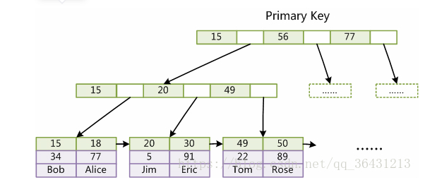

# 一、MySQL聚簇索引和非聚簇索引的区别

#### 1.1 聚簇索引（聚集索引）和非聚簇索引的定义

**聚簇索引（聚集索引）**

> 一种索引，该索引中键值的逻辑顺序决定了表中相应行的物理顺序，聚簇索引的叶节点就是数据节点

**非聚簇索引**

> 一种索引，该索引中索引的逻辑顺序与磁盘上行的物理存储顺序不同，非聚簇索引的叶节点仍然是索引节点，只不过有一个指针指向对应的数据块

如MySQL的InnoDB存储引擎，使用的是聚簇索引，一张表只能由一个聚簇索引，

Innodb中：聚簇索引默认是主键，如果表中没有定义主键，InnoDB 会选择一个唯一索引代替。如果没有这样的索引，InnoDB 会隐式定义一个主键来作为聚簇索引，主键使用的是聚簇索引，非主键使用的是非聚簇索引

Innodb中：在聚簇索引之上创建的索引称之为辅助索引，辅助索引访问数据总是需要二次查找，非聚簇索引都是辅助索引，像复合索引、前缀索引、唯一索引，辅助索引叶子节点存储的不再是行的物理位置，而是主键值

聚簇索引的优势

1. 聚簇索引比非聚簇索引少了一次读取数据的IO操作，所以查找性能上会更好
1. 聚簇索引的数据和B+树的叶子结点是存储在一起的，合适用来做排序，区间查找操作

聚簇索引的劣势

1. 如果使用随机ID作为主键，是数据存储稀疏，这就会出现聚簇索引有可能有比全表扫面更慢，所以建议让主键自动增长（auto_increment）
2. 维护索引的代价成本高，辅助索引占的空间大（要存主键），

#### 1.2 非聚簇索引（非聚集索引）

MySQL的MyISAM引擎，不管主键还是非主键，使用的都是非聚簇索引

非聚簇索引将索引和数据分开存储，索引的叶子结点上存储数据的地址指针，key是索引的列

