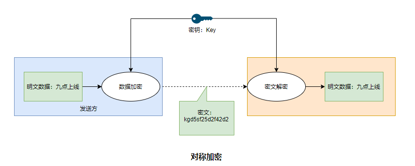
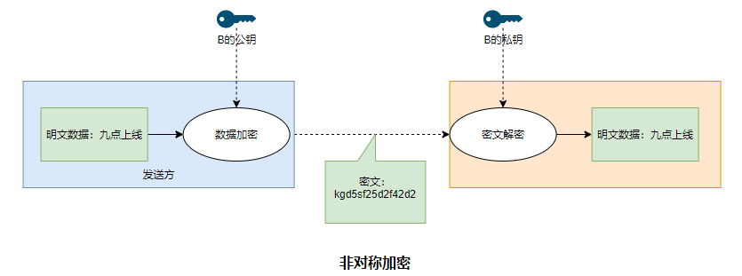
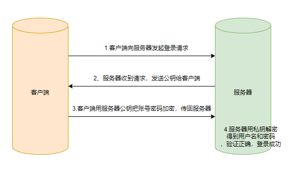
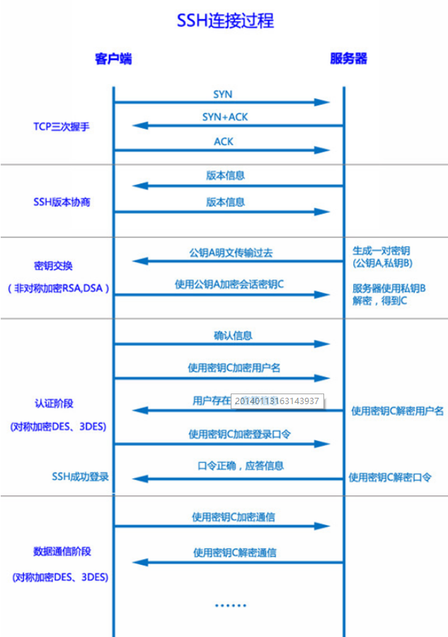
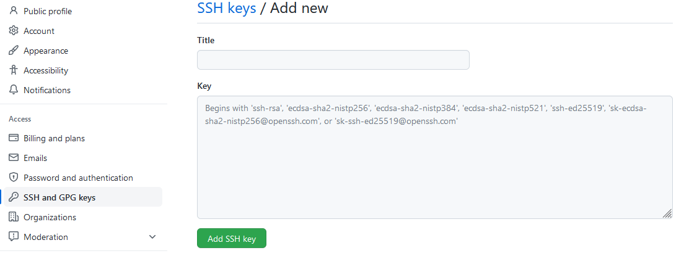
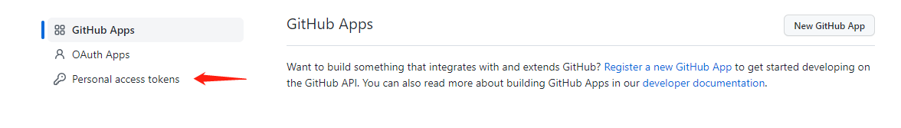
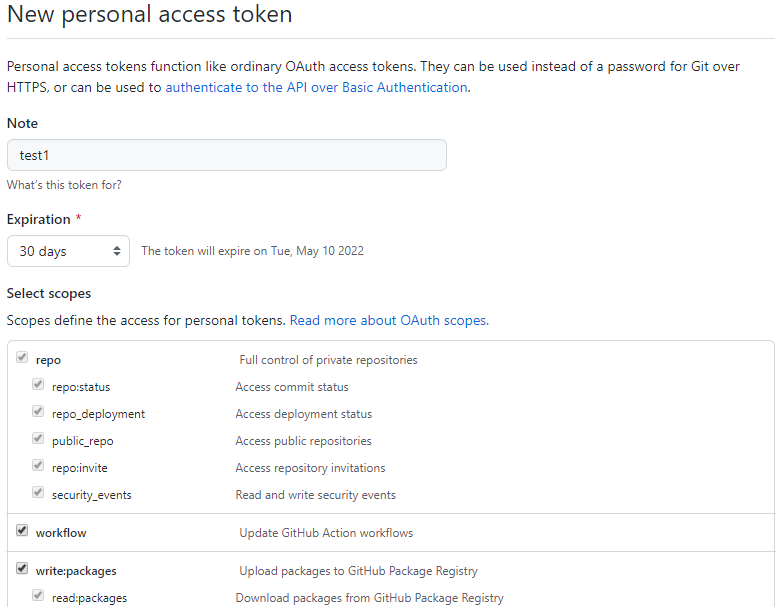

# Git 使用SSH 免密认证

## **对称加密和非对称加密**

在密码学中，加密（Encryption）是将明文信息通过加密方法变成难以读取的密文内容，使之不可读的过程，加密算法就是加密的方法，通过算法生成随机密钥。解密时拥有解密方法的对象将密文还原为正常可读的内容。加密本身不能防止信息被截取，但加密可以防止信息不被截取者理解，早期加密常用于军事通讯，现在加密被大量用于计算机通讯

### 加密的分类

> 密码学从密钥的数量角度把加密分为两类：对称加密和非对称加密

**对称加密（密钥加密）**

对称加密是加密和解密使用相同密钥的算法，加密和解密的速度快、效率高适用于大量数据的加密。对称加密的算法公开，安全性取决于密钥的大小和密钥的保密性。

所以密钥的传输和管理也成为对称加密的缺点，密钥在传输过程中会有泄露的风险，每次对称加密都会产生一个密钥，大量密钥的管理会双方的负担

对称加密常用的算法：DES、3DES、AES

- DES：数据加密标准，加密强度小，不安全
- 3DES：原理和DES一样，使用3个密钥对数据进行3次加密，增加加密强度，但要维护3个密钥
- AES：高级加密标准，目前美国国家安全局使用的，苹果的钥匙串访问采用的就AES加密。是现在公认的最安全的加密方式，是对称密钥加密中最流行的算法



**非对称加密（公钥加密）**

非对称加密会生成一对密钥，公钥（Public Key）和私钥（Private Key）；由公钥加密的信息，只有私钥才能解密，相反由私钥加密的信息，也只有公钥才能解密；由于加密的公钥是公开给别人加密，解密的私钥是自己保存，所以解决了密钥在传输过程中暴露的风险，缺点是算法强度大，速度慢；优点是安全

非对称加密常用的算法：RSA




## SSH

### SSH介绍

Secure Shell（安全外壳协议，简称SSH）是一种加密的网络传输协议，可在为不安全的网络服务提供安全的传输环境。SSH通过在网络中建立安全隧道来实现SSH客户端玉服务器之间的连接，SSH最常见的用途是远程登陆（常用于远程登录Linux服务器）。

在设计上，SSH可以用来代替Telnet和rlogin、Telnet、FTP、rsh等安全性不足的协议，这些协议采用明文传输，数据一旦被截获，就有泄露的风险，且容易受到中间人攻击，SSH可以在不安全的网络环境中保证信息安全完整可靠

**SSH的特性**

SSH的主要特性是加密、通信的完整性、认证、授权、端口转发

- 加密：建立加密通道避免数据泄露
- 通信的完整性：避免数据被篡改，SSH-2通过MAC（消息认证码），SSH-1使用CRC-32
- 认证：提供服务端对客户端的身份认证
- 授权：用户访问控制
- 端口转发

**SSH密钥管理**

在Linux系统，用户上传的公钥被保存在`~/.ssh/authorized_keys `文件中，该文件只有SSH使用，持有对应私钥的本地客户端登录不需要手动输入密码。如果需要额外的安全性，私钥本身也能用密码保护

**SSH的应用**

SSH协议的经典用途是登录到远程电脑中执行命令（就是登录到Linux服务器），SSH也支持隧道协议、端口映射和X11连接。借助SFTP或SCP协议，SSH还可以传输文件

SSH使用客户端-服务端模型，标准端口为22。服务器端需要开启SSH守护进程以便接受远端的连接，而用户需要使用SSH客户端与其创建连接

大多数现代的操作系统（包括macOS、大部分Linux、OpenBSD、FreeBSD、Solaris等系统）都提供了SSH，包括Windows系统也提供SSH程序（在Windows 10 1809版本之后）。还有很多常用SSH客户端：PuTTY、Xshell等等

**SSH的历史和版本**

**SSH-1**（有漏洞，不安全）

芬兰赫尔辛基理工大学的塔图·于勒宁发现自己学校存在嗅探密码的网络攻击，便在1995年编写了一套保护信息传输的程序，并称其为“secure shell”（就是SSH-1）。设计目标是取代先前的rlogin、Telnet、FTP和rsh等安全性不足的协议。1995年7月，于勒宁以免费软件的形式将其发布。程序很快流行起来，截至1995年底，SSH的用户数已经达到两万，遍布五十个国家。

1995年12月，于勒宁创立了SSH通信安全公司来继续开发和销售SSH。SSH的早期版本用到了很多自由软件，例如GNU libgmp，但后来由SSH公司发布的版本逐渐变成了专有软件。

**OpenSSH和OSSH**

1999年，开发者们希望使用免费版本的SSH，于是重新使用较旧的1.2.12版本，这也是最后一个采用开放源代码许可的版本，后来瑞典程序员Bjorn Gronvall基于这个版本开发了OSSH。后面OpenBSD的开发人员在Gronvall代码上创建了新的分支，并进行了大量的修改，最终形成了可移植性分支OpenSSH

OpenSSH是目前使用最广泛的SSH开源实现，成为了大多数现代操作系统的默认组件，OSSH已经过时，OpenSSH人在维护，目前已经支持SSH-2协议。7.6版本开始，OpenSSH不在支持SSH-1协议

**SSH-2**

2006年，IETF 的网络小组制定了SSH协议的第二版本（SSH-2），SSH-2协议成为了新的标准。，与SSH-1相比，SSH-2进行了一系列功能改进并增强了安全性，例如用Diffie–Hellman算法代替RSA完成密钥交换、使用MAC代替CRC来保证数据的完整性、SSH-2还支持通过单个SSH连接任意数量的shell会话。由于SSH-2和SSH-1并不兼容，一些实现开始只支持SSH-2.

**SSH的基本架构**

- 传输层协议（The Transport Layer Protocol）：传输层协议提供服务器认证，数据加密，信息完整性等支持
- 用户认证协议（The User Authentication Protocol）：用户认证协议为服务器提供客户端的身份鉴别
- 连接协议（The Connection Protocol）： 连接协议将加密的信息隧道复用成若干个逻辑通道，提供给更高层的应用协议使用； 各种高层应用协议可以相对地独立于SSH基本体系之外，并依靠这个基本框架，通过连接协议使用SSH的安全机制。

> 各种高层应用协议可以相对地独立于SSH基本体系之外，并依靠这个基本框架，通过连接协议使用SSH的安全机制。

### SSH认证的工作原理

1、版本号协商阶段

SSH使用服务端-客户端模型，SSH服务端（守护进程）打开服务端口（默认22），等待客户端连接。

客户端发起TCP连接请求，服务端返回自己支持的SSH协议版本信息，客户端收到后会根据双方支持的版本协商出使用的版本。如果协商成功， 客户端和服务端会建立了明文的通信通道

2、密钥和算法协商阶段

版本号协商成功后，服务器会提供主机公钥让客户端确认主机的真实性。如果客户端时第一次访问服务器，客户需要对服务器的公钥指纹进行确认，然后开始算法和密钥的协商。

服务端和客户端分别发送算法协商报文给对方，报文中包含了自己支持的公钥算法列表、加密算法列表、MAC（Message Authentication Code，消息验证码）算法列表、压缩算法列表等；服务器端和客户端根据对端和本端支持的算法列表得出最终使用的算法；服务器端和客户端利用 DH交换（Diffie-Hellman Exchange）算法、主机密钥对（这里的密钥对和认证使用的密钥对是没有关系的）等参数，生成会话密钥和会话 ID。

这时候服务器和客户端会取得相同的会话密钥和会话ID，建立了会话加密通道，后面所有传输的数据都会使用会话密钥加密

3、认证阶段

> 认证阶段的通信都是用上一阶段的密钥进行加密

SSH主要有两种身份验证方式：

1. 第一种级别（基于密码的认证）：知道账号和密码，就可以登录带远程主机，并且所有传输的数据都会被SSH传输层协议加密。但是可以会有别的服务器在冒充真正的服务器，但只要客户端校验主机公钥，在服务器私钥不泄露的前提下就能避免“中间人攻击”

2. 第二种级别（基于密钥的认证）：需要客户端创建一对密钥，并把公钥放在需要访问的服务器上。

**密码认证**

密码认证简单方便，不用配置，只需要输入账号密码；虽然认证阶段的通信都是经过加密的，但是如果密码过于简单还是会有被暴力破解的可能，密码认证的方式并不推荐，服务端也可能禁止密码登录的方式

密码登录的过程：

1. 客户端发送认证请求，服务端收到客户端的请求后，把服务器公钥发送给客户端
2. 客户端使用收到的服务器公钥给密码加密，并发送会服务器
3. 服务器使用自己的私钥解密，校验密码，则验证通过



**密钥认证**

密钥认证是推荐使用的认证方式，更安全，更方便，密钥认证只需要在客户端生成密钥对，然后把公钥添加到访问的服务器上，就可以实现免密登录，这样密码也不需要在网络上传输

密钥登录的过程：

1. 客户端生成一对密钥，然后手动把公钥添加到服务器上，密钥保存在服务器的`~/.ssh/authorized_keys`文件中
2. 客户端将加密过的账号、客户端公钥、认证方法发送给服务端。
3. 服务端用密钥解密，服务端会找有没有对应的公钥，找到后服务器会生成一个随机字符串（质询），然后用对应的公钥加密质询，再用密钥加密
4. 客户端收到加密的质询，用公钥和密钥解密得到质询，然后将质询和会话ID一起MD5生成摘要，用私钥加密（就是数字签名），发送给服务器
5. 服务器一样将质询和会话ID一起MD5生成摘要，如果相同则认证成功

> 密钥登录不仅客户端要确认服务器的身份，服务器也会用数字签名确认客户端的身份

**防止中间人攻击**

SSH认证整个过程都是经过加密的，本身很安全。但是如果有中间人冒充服务器，给客户端传输了自己的公钥（中间人攻击），那么用户密码就会暴露。由于SSH协议的公钥都是自己签发的，不会像HTTPS一样去证书中心（CA）公证。在建立加密通道阶段和密码认证都需要服务器首先把公钥传输到客户端，怎么保证服务端公钥真实性，

> 公钥指纹：将公钥进行MD5（因为公钥很长，很难对比）

当客户端是第一次登录服务器，客户端会出现提示：

```
无法确认 host 主机的真实性，只知道它的公钥指纹，问你还想继续连接吗？
```

用户只需要跟目标服务器的公钥指纹对比，就能确认公钥的真实性；如果不知道服务器的公钥指纹，就要自己权衡

当服务器的公钥被接受了，就会保存在文件`~/.ssh/known_hosts`中，下次再连接这台服务器，系统会检查`known_hosts`文件，如果存在公钥记录，就会跳过警告




##  GIt 使用SSH 实现免密登录

Git想要访问Github服务器上的库进行`pull`和`push`的时候，需要向服务器进行身份认证

通过命令行访问Github 上的存储库常用有两种方式：HTTPS 和 SSH

> 2021 年 8 月 13 日开始，我们将在对 Git 操作进行身份验证时不再接受帐户密码，并将要求使用基于令牌（token）的身份验证。

**HTTPS**

- HTTPS可以直接使用账号密码登录，比SSH要生成SSH key进行配置更简单
- HTTPS使用 443 端口一般企业的防火墙都会打开。SSH使用的 22 端口可能会被防火墙屏蔽
- HTTPS速度慢，每次推送都要输入口令，但是可以用git工具提供缓存账号密码的功能来避免重复输入口令，如Windows的凭证管理器

**SSH**

- 需要生成SSH key，然后上传到服务器
- 使用 22 端口，可能被屏蔽
- 不能匿名访问，不便于开源项目

### SSH 密钥生成

> SSH 密钥默认保留在 ~/.ssh 目录中。 如果没有 ~/.ssh 目录，ssh-keygen 命令会使用正确的权限创建一个

1、 打开Git Bash，检查现有 SSH 密钥

```bash
$ ls -al ~/.ssh
```

2、如果SSH Key不存在，生成一个新的SSH Key，

```bash 
ssh-keygen -t rsa -C "your_email@example.com"
```

常用的参数

- -t 指定密钥类型，默认是 rsa，可选(ed25519)
- -b 密钥的长度，可选
- -C 设置注释文字，一般是邮箱，可选
- -f 指定密钥文件存储文件de名

SSH Key常用的类型有两种：`rsa` 和 `ed25519 `

- rsa是目前兼容性最好的，应用最广泛的key类型，ssh-keygen默认也是使用rsa，但是rsa的长度太少会存在安全问题，推荐使用`-b 4096`指定密钥长度
- ed25519 是最安全、加密解密速度最快的密钥类型，它的密钥长度比rsa小很多，优先推荐使用，他目前唯一的问题就是兼容性，旧版本的OpenSSH无法使用

>总结：优先使用ed25519 ，不兼容则使用rsa


当系统提示您“输入要在其中保存密钥的文件”时，按 Enter。接受默认文件位置，默认使用默认文件名即`id_rsa`和`id_rsa_pub`，如果自定义文件名不填写路径默认生成在当前文件夹k

```bash
> Enter file in which to save the key (/c/Users/Zhongbf/.ssh/id_rsa): # 自定义Key的文件名
```

当系统提示您“输入密码”时，按 Enter，默认没有密码，如果设置了密码，使用私钥时需要输入这个密码；一般不设置（如果你的电脑还有别人在使用，设置私钥密码更安全），更改这个密码可以用`ssh-keygen -p`命令

```bash
> Enter passphrase (empty for no passphrase):	# 私钥密码
> Enter same passphrase again:	# 重复填写私钥密码
```

密钥对生成后到 `~/.ssh`（默认），复制公钥到目标服务器上


### 添加SSH Key到服务器（如Github）

> 其他的服务器大同小异，也可以取查看使用文档

用下面命令复制公钥`id_rsa_pub`文件的内容，或者直接到`~/.ssh/id_rsa.pub`目录复制

```bash
$ clip < ~/.ssh/id_rsa.pub
```


然后登录Github，找到`Settings`—>`SSH and GPG keys`，把公钥复制进去即可



添加完成后测试是否添加成功

```bash
$ ssh -T git@github.com
```

第一次连接会提示确认服务器真实性，填`yes`后，会自动生成文件`~/.ssh/known_hosts`存放信任主机的信息，下次在连接会优先读取文件里的SSH key

```bash
The authenticity of host 'github.com (140.82.112.4)' can't be established.
ECDSA key fingerprint is SHA256:p2QAMXNIC1TJYWeIOttrVc98/R1BUFWu3/LiyKgUfQM.
Are you sure you want to continue connecting (yes/no/[fingerprint])? yes
```


### 多对SSH key 的配置

> 两种场景
>
> - 一台Git服务器只有一个账号，SSH Key可以重复使用，直接把公钥添加到使用的服务器上
> - 一台Git服务器有两个账号，需要创建两对SSH Key

**场景一：一台Git服务器只有一个账号**

我们想要在多个Git服务器上，如Github、Gitee、Gitlab、Coding等同时配置SSH key，只需要生成一对默认密钥对`id_rsa`和`id_rsa_pub`，然后把SSH公钥部署在Git服务器上，就可以连接到对应的服务器（推荐这样使用）

因为ssh命令默认将`id_rsa`作为私钥、`id_rsa_pub`作为公钥来进行验证， 如果想要使用非默认的密钥对，为不同的服务器配置不同的密钥对，可以对密钥进行配置

- 使用密钥管理器`ssh-agent`

  ```bash
  $ ssh-add ~/.ssh/id_rsa_github # 添加私钥
  ```

- 或者在`~/.ssh/config`指定服务器对应私钥

  ```bash
  # github.com server
  Host github.com
  IdentityFile ~/.ssh/id_rsa_github
  #gitee.com server
  Host gitee.com
  IdentityFile ~/.ssh/id_rsa_gitee
  ```

**场景二：一台Git服务器有多个账号**

用户在Githut有一个私人账号，而且已经创建了一对SSH key，现在公司也有项目放在Github，需要连接公司的账号。由于Github中两个不同账号不能使用同一对SSH key，所以公司的账号不能使用私人账号的SSH key，必须要为公司的账号创建一对新的SSH key。这时候要对`~/.ssh/config`进行配置

```
Host github1 
    User git    
    HostName github.com
    Port 22
    IdentityFile ~/.ssh/id_rsa

Host github2
    User git    
    HostName github.com
    Port 22
    IdentityFile ~/.ssh/id_rsa_github
```

Host：如果一个域名下有多个账号，用简称来区分，在推送和拉取代码代替原本的域名，调用对应的私钥验证

User：服务器的用户名，大部分Git服务器默认的用户名是git（默认的可以省略）

domain：服务器的域名或IP（如：github.com）

IdentityFile：私钥的绝对路径

port：端口号（默认是22，可以省略）


在对账号私钥配置后，要用简称来代替原来的域名

```bash
# 测试连接
$ ssh -T github1
$ ssh -T github2
# 推送或拉取代码 把github.com改成github1
$ git@github1:name/Hello-World.git
```


### Git 凭证存储模式

git的凭证存储避免了使用HTTPS协议时需要重复输入口令的缺点，如OSX的keychain 、Windows的凭证管理器

Git 的默认凭证存储模式 `wincred`，可以通过配置文件或者命令查看

```bash
# 查看
$ git config credential.helper
wincred
# 修改
$ git config credential.helper <模式>
# 删除凭证，可以输入新的账号密码
git config --unset credential.helper
```

可选的凭证存储模式

**`cache`**

会将凭证存放在内存中一段时间。 密码永远不会被存储在磁盘中，并且在15分钟后从内存中清除

**`store`**

会将凭证用明文的形式存放在磁盘中，并且永不过期。 这意味着除非你修改了你在 Git 服务器上的密码，否则你永远不需要再次输入你的凭证信息。 这种方式的缺点是你的密码是用明文的方式存放在你的 home 目录下

**`osxkeychain`**

如果你使用的是 Mac，Git 还有一种 “osxkeychain” 模式，它会将凭证缓存到你系统用户的钥匙串中。 这种方式将凭证存放在磁盘中，并且永不过期，但是是被加密的，这种加密方式与存放 HTTPS 凭证以及 Safari 的自动填写是相同的

**`manager`**（推荐）

如果你使用的是 Windows，你可以安装一个叫做 “Git Credential Manager for Windows” 的辅助工具。 这和上面说的 “osxkeychain” 十分类似，但是是使用 Windows Credential Store 来控制敏感信息，

manager 和 wincred 都是将用户信息存储到windows凭据管理器中，但是manager会将用户信息加密

下载安装地址：<https://github.com/Microsoft/Git-Credential-Manager-for-Windows/releases/tag/1.20.0>


### Github 个人访问令牌（PAL）机制

从 2021 年 8 月 13 日开始，我们将在对 Git 操作进行身份验证时不再接受帐户密码，并将要求使用基于令牌（token）的身份验证，例如个人访问令牌（针对开发人员）或 OAuth 或 GitHub 应用程序安装令牌（针对集成商） Github 上所有经过身份验证的 Git 操作。 您也可以继续在您喜欢的地方使用 SSH 密钥。

```bash
remote: Support for password authentication was removed on August 13, 2021. Please use a personal access token instead.
```

#### 令牌的好处

令牌与基于密码的身份验证相比：

- 唯一性：令牌特定于 GitHub，可以按使用或按设备生成。
- 可撤销：可以随时单独撤销令牌，而无需更新未受影响的凭据。
- 有限性：令牌可以缩小范围以仅允许用例所需的访问。
- 随机性：令牌不需要记住或定期输入的更简单密码可能会受到的字典类型或蛮力尝试的影响。


#### 生成个人访问令牌（PAL）

1、登录GIthub—>`Settings`—>`Developer settings`



2、填写Note（名称）、到期时间、权限范围




3、创建好了令牌，要像密码一样保存下来，页面刷新就看不见了，用HTTPS推送代码用令牌代替密码，更新一下缓存凭证


### ssh agent

ssh agent是一个密钥管理器，用来管理一个或多个密钥，为SSH客户端使用SSH key连接服务器提供代理

**ssh agent的作用**

当我们使用默认的公钥和私钥（id_rsa和id_rsa_pub）,不需要启动 ssh-agent

1、如果客户端生成了多对密钥，那么就需要手动指定服务器对应的密钥，把私钥添加到ssh agent，ssh agent可以代理整个认证过程，不需要在config文件手动指定对应的密钥

2、当你为你的私钥设置了密码，只需要把私钥添加到ssh agent，避免密码重复输入


**使用ssh agent**

运行 ssh agent有两种方法，手动运行和自动启动，先看手动运行，如果报下面错误说明ssh agent没有打开

```bash
Could not open a connection to your authentication agent
```

手动运行ssh agent有两种方法：

- `ssh-agent $shell`也可以指定shell，如`ssh-agent bash `
- Windows中`eval $(ssh-agent)`

ssh agent的一些常用命令：

```bash
# 手动添加私钥
ssh-add ~/.ssh/id_rsa_2
# 查看加载的密钥
ssh-add -l
# 关闭ssh agent
ssh-agent -k
```


**ssh agent的自动启动**

Linux：ssh agent 一般会自动开启

Windows：

- 在`服务`中把`OpenSSH Authentication Agent`设置为自动
- 也可为`git bash`添加配置文件`.bashrc`，

```
env=~/.ssh/agent.env

agent_load_env () { test -f "$env" && . "$env" >| /dev/null ; }

agent_start () {
    (umask 077; ssh-agent >| "$env")
    . "$env" >| /dev/null ; }

agent_load_env

# agent_run_state: 0=agent running w/ key; 1=agent w/o key; 2= agent not running
agent_run_state=$(ssh-add -l >| /dev/null 2>&1; echo $?)

if [ ! "$SSH_AUTH_SOCK" ] || [ $agent_run_state = 2 ]; then
    agent_start
    ssh-add
elif [ "$SSH_AUTH_SOCK" ] && [ $agent_run_state = 1 ]; then
    ssh-add
fi


unset env
```


